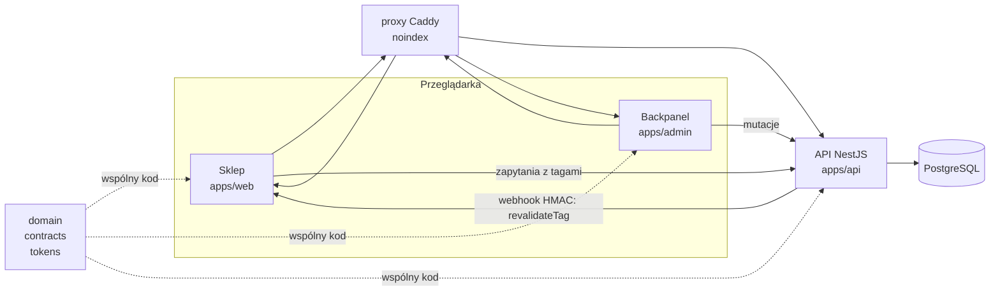

# Taktyl

[](https://github.com/Mariusz8Walczak/taktyl/actions/workflows/ci.yml)

Wzorcowy sklep demonstracyjny z klawiaturami, myszkami i podkładkami oraz kreatorem setu („Zbuduj set”), zbudowany jako monorepo NestJS + Next.js + PostgreSQL, w całości uruchamiany w Dockerze.

> **Taktyl jest sklepem fikcyjnym.** Nie realizuje zamówień, nie pobiera płatności (płatność to symulacja, bez pól na dane kart, kody BLIK i hasła w sklepie), nie jest indeksowany (`noindex`). Marka, firma, adresy i opinie są wymyślone.

## Co działa

Scenariusze odbioru S1-S36 zostały uruchomione w Dockerze (wyniki i jedno otwarte zadanie: sekcja „Wyniki odbioru”).

- **Sklep (`apps/web`):** katalog 18 produktów (99 wariantów) z filtrami w adresie, karta produktu z ceną i „najniższą ceną z 30 dni” liczoną z historii cen, wyszukiwarka, koszyk, zamówienie z **symulowaną płatnością**, poradniki, strony prawne i informacyjne.
- **Kreator setu „Zbuduj set” (`docs/03`):** klawiatura + myszka + podkładka, sprawdzenie wymiarów na biurku, −10% za komplet, liczone w groszach w `packages/domain`.
- **Backpanel (`apps/admin`):** produkty i warianty, ceny i stany, treści i opisy, opinie, zamówienia i statusy, zgłoszenia z formularzy, ustawienia sklepu, użytkownicy i role (`owner`, `editor`, `viewer`), dziennik zmian.
- **Propagacja zmian w ≤ 5 s (ADR-0003):** mutacja w backpanelu -> commit -> outbox -> webhook HMAC -> `revalidateTag` w sklepie. Gdy sklep jest wyłączony, outbox ponawia dostawę po jego powrocie (S30, `make smoke-outbox`).
- **API (`apps/api`):** NestJS, kontrakty w Zod, wycena koszyka po stronie serwera (API nie ufa kwotom klienta, ADR-0007), OpenAPI pod `/docs` (poza produkcją albo przy `OPENAPI_ENABLED=true`).
- **Tryb demo (ADR-0006):** konto `viewer` bez hasła, cykliczny reset danych, zaostrzone limity żądań.
- **Dyscyplina projektowa:** wygląd wyłącznie z tokenów, ruch wyłącznie z katalogu animacji A-01…A-18, dostępność WCAG 2.1 AA (axe), budżet JS, polszczyzna przez `Intl`, kwoty w groszach, brak własnej grafiki.
- **Praca z agentami:** definicje specjalistów i skilli w `.claude/`, zadania w task-managerze, każda funkcja z ID (`F-`, `A-`, `B-`, `I-`).

## Architektura



Szczegóły: `docs/14-architektura.md`, `docs/18-przeplywy.md`.

## Szybki start (Docker)

Wymagania: Docker z Compose v2 i git. Lokalny Node ani PostgreSQL nie są potrzebne.

```bash
cp .env.example .env              # uzupełnij wartości CHANGE_ME (albo: make env, losowe sekrety lokalne)
docker compose up --build         # baza, migracje, seed, API, sklep, backpanel, proxy
```

| Adres | Co |
|---|---|
| `http://taktyl.localhost` | sklep |
| `http://admin.taktyl.localhost` | backpanel |
| `http://api.taktyl.localhost` | API (`/health`, OpenAPI pod `/docs`) |

Gdy port 80 jest zajęty, ustaw `PROXY_HTTP_PORT` w `.env` (np. `8080`) i wchodź na `http://taktyl.localhost:8080`.

### Loginy demo

Żaden sekret nie leży w repozytorium; hasło powstaje w Twoim lokalnym `.env`.

| Konto | Jak wejść do backpanelu |
|---|---|
| `owner@taktyl.example` | hasło to `ADMIN_BOOTSTRAP_PASSWORD` z `.env` (`make env` losuje je przy tworzeniu pliku; wartość zobaczysz poleceniem `grep ADMIN_BOOTSTRAP_PASSWORD .env`). Konto powstaje przy pierwszym starcie API. Z `cp .env.example .env` musisz sam zastąpić `CHANGE_ME` (min. 12 znaków), inaczej API nie utworzy konta |
| `viewer@taktyl.example` | tylko przy `DEMO_MODE=true` (sekcja „Tryb demo”): przycisk „Wejdź jako viewer”, rola tylko do odczytu, bez hasła |

Sklep nie ma kont z hasłami.

### Polecenia

```bash
make dev                                              # hot reload (profil dev, kod z hosta)
make test                                             # testy w kontenerze (Vitest, baza testowa w pamięci)
make e2e                                              # Playwright S1-S36 na pełnym stosie
```

Skróty (`make help` wypisuje wszystkie): `make up`, `make dev`, `make test`, `make e2e`, `make reset` (dane demo z `data/*.json`), `make logs`, `make down`, `make clean` (kasuje wolumeny), `make lint`, `make typecheck`, `make audit-tokens`, `make audit-design`, `make smoke`, `make smoke-outbox`, `make smoke-demo`. Bez `make` działają odpowiedniki `docker compose` z pliku `Makefile`. Hook pre-commit: `git config core.hooksPath .githooks`.

## Testy i audyty

Wszystko w kontenerach (ADR-0009), z korzenia repozytorium.

| Co | Polecenie |
|---|---|
| Testy jednostkowe i integracyjne (Vitest) | `make test` (bez make: `docker compose --profile test run --rm test`) |
| Scenariusze odbioru S1-S36 (Playwright, pełny stos) | `make e2e`; jeden plik: `make e2e ARGS="tests/pomiar.spec.ts"` |
| Lint, typy | `make lint`, `make typecheck` |
| Audyt tokenów (zero kolorów wpisanych wprost) | `make audit-tokens` |
| Audyt ruchu (`docs/07`) | `docker compose --profile test run --rm --no-deps test pnpm audit:motion` |
| Audyt designu `docs/12` §3 | `make audit-design` (wymaga działającego stosu) |
| Audyt treści | `docker compose --profile test run --rm --no-deps test node scripts/validate-content.mjs` |
| Test dymny stosu, S30 (outbox), tryb demo | `make smoke`, `make smoke-outbox`, `make smoke-demo` |
| Ścieżki zakazane w repozytorium | `sh scripts/check-forbidden-paths.sh` |

CI (`.github/workflows/ci.yml`) uruchamia te same kontenery. Joby: `lint`, `typecheck`, `unit`, `audyt-tokenow`, `build-images`, `e2e-docker`, `e2e-demo`, `actionlint`, `kontrola-sciezek`, `gitleaks`, `audit-deps`.

## Wyniki odbioru

Pełny raport: [`docs/23-raport-odbioru.md`](docs/23-raport-odbioru.md) (2026-10-08, TAKTYL-71; Docker, build produkcyjny, od pustych wolumenów).

| Obszar | Wynik |
|---|---|
| Playwright (S1-S30, S34-S36 w części axe) | 149 passed, 2 skipped (testy `@mobile` w projekcie `desktop`, przeszły w `mobile`), 0 flaky |
| Vitest | 1431 testów zielonych (domain 129, tokens 9, contracts 97, ui 112, admin 124, web 579, api 381) |
| lint, typecheck, audit:tokens, audit:motion | zielone, 0 trafień |
| Start od zera (S31) | 80 s z ciepłym cache warstw, 197 s zimny (limit 600 s) |
| Budżet JS | treść 141,8-149,5 kB gzip (limit 150), aplikacja do 166,6 kB (limit 400) |
| S36 (wydajność) | **częściowo:** a11y, audyt designu i budżet JS przeszły; **brak Lighthouse CI** (LCP, CLS, INP), zadanie TAKTYL-83 |

Znane odstępstwo: Q-08 (kafel koloru bez stanu pokazuje „Brak” zamiast być wybieralny, `docs/decyzje.md`).

## Tryb demo

Publiczne demo (I-009, `docs/15` B-007 i B-014, ADR-0006) włącza się w `.env` i uruchamia profilem `demo`:

```bash
# w .env: DEMO_MODE=true
docker compose --profile demo up --build --wait   # albo: make demo
sh scripts/smoke-demo.sh                          # test dymny trybu demo (albo: make smoke-demo)
```

| Zmienna | Znaczenie |
|---|---|
| `DEMO_MODE` | `true` = przycisk „Wejdź jako viewer” (tylko odczyt), reset danych demo, zaostrzone limity żądań |
| `DEMO_RESET_INTERVAL_MINUTES` | odstęp między cyklicznymi resetami (usługa `reset-demo`), domyślnie `60`; pierwszy reset po pierwszym odstępie |
| `DEMO_THROTTLE_READ_LIMIT`, `DEMO_THROTTLE_WRITE_LIMIT` | sufity żądań na minutę na adres IP (odczyt, zapisy i logowanie), domyślnie `60` i `5`; liczy się mniejszy z sufitem i limitem endpointu |
| `ORDER_RETENTION_DAYS`, `MESSAGE_RETENTION_DAYS` | po tylu dniach (domyślnie `30`) znikają dane osobowe zamówień oraz zgłoszenia z formularzy |

Zachowanie: reset (`db:reset-demo`) przywraca dane z `data/*.json` w jednej transakcji (żądania widzą stan sprzed albo po resecie), nie rusza kont ani sesji backpanelu i plików w wolumenie `media`, zapisuje wpis `demo.reset` w dzienniku zmian i wysyła znaczniki rewalidacji, więc sklep odświeża się sam. Ręcznie: `make reset`, albo przycisk „Zresetuj dane demo” w Ustawieniach (tylko `owner`, wymaga wpisania słowa „reset”). Przy `DEMO_MODE=false` endpoint `POST /v1/admin/demo/reset` odpowiada `404`, a usługa `reset-demo` odmawia startu.

Start od zera (S31): `docker compose --profile demo up --build --wait` na świeżych wolumenach zajął 197 s (limit z `docs/12`: 10 min), pomiar i metoda w `docs/decyzje.md` (I-009). Job CI `e2e-demo` mierzy to przy każdym pushu.

**Uwaga bezpieczeństwa: nigdy nie ustawiaj `DEMO_MODE=true` w środowisku z prawdziwymi danymi.** Reset usuwa zamówienia i zgłoszenia, a konto `viewer` wchodzi bez hasła.

## Stos i wersje

Źródło prawdy: `package.json` (korzeń, `apps/*`, `packages/*`); zasady przypinania: `docs/adr/0010-aktualizacja-zaleznosci.md`.

| Warstwa | Wersja |
|---|---|
| Runtime | Node 24 (LTS, obrazy `alpine` z digestem), pnpm 12.10, Turborepo 2.11 |
| API | NestJS 12, Prisma 7 (adapter `pg`), Zod 4, pino 10 |
| Sklep i backpanel | Next.js 16.4, React 19.3 |
| Baza | PostgreSQL 16.15 (zostajemy przy 16, ADR-0010) |
| Proxy | Caddy 2.11 (nagłówek `noindex`) |
| Język i narzędzia | TypeScript 6.0 (strict), ESLint 10, Prettier 3.9, Vitest 5 |
| Testy end-to-end | Playwright 1.63, axe-core |

## Dane: co wolno

`data/*.json` to seed i wzorzec (ADR-0005). W runtime źródłem prawdy jest baza edytowana backpanelem.

| Kto / co | Wolno | Nie wolno |
|---|---|---|
| Właściciel w backpanelu | edytować ceny, stany, opisy, ustawienia; zmiany widać w sklepie w ≤ 5 s | wpisywać prawdziwe marki ani obietnice medyczne (walidacja kończy się błędem 422) |
| Współtwórca lub model | zmieniać kod, dokumentację, testy; przywracać dane przez `make reset` | dopisywać produkty, warianty, ceny, stany, parametry i marki do `data/*.json` lub seedu |
| „Najniższa cena z 30 dni” | liczy API z `price_history` | pole wpisywane ręcznie |
| Kwoty | grosze (`Int`), format przez `Intl` | liczby zmiennoprzecinkowe, ręczne formatowanie |
| Adresy e-mail | domena `taktyl.example` | prawdziwe adresy, NIP-y, telefony |
| Zdjęcia | pliki z `assets/manifest.json` dostarczone przez człowieka | rysunki, SVG, gradienty udające obraz (do czasu zdjęć są placeholdery) |

## Decyzje w skrócie

| Obszar | Decyzja | Dokument |
|---|---|---|
| Nazwa | **Taktyl** (od „taktylny”) | `docs/01-marka-i-nazwa.md` |
| Rdzeń oferty | Set: klawiatura + myszka + podkładka, sprawdzony wymiarami, −10% za komplet | `docs/03-kreator-setu.md` |
| Stos | NestJS + Next.js + PostgreSQL/Prisma + Zod, pnpm + Turborepo (zastąpił Astro + czysty JS); wersje: sekcja „Stos i wersje” | `docs/adr/0001-stos-nestjs-nextjs.md`, `docs/adr/0010-aktualizacja-zaleznosci.md` |
| Dane | `data/*.json` = seed (18 produktów, 99 wariantów, 4 sety); w runtime baza, edytowana backpanelem | `docs/adr/0005-baza-danych-i-dane-zrodlowe.md` |
| Szablon | Crafto (wariant z `docs/08` §6); jego pliki **nie są** w repozytorium | `docs/adr/0004-szablon-crafto-i-licencja.md` |
| Uruchomienie | Docker Compose, profile `dev`, `test`, `e2e`, `demo` | `docs/adr/0009-docker-first.md` |
| Kolorystyka | Paleta jak zestaw keycapów, kobaltowy „Enter” jako jedyny akcent | `docs/06-design-system.md` |
| Font | Archivo (jedna rodzina, oś szerokości), 64 KB | `docs/06-design-system.md` |
| Ruch | Przyciski wciskają się jak klawisz; katalog A-01…A-18 | `docs/07-animacje.md` |
| Grafika | Model niczego nie rysuje; zdjęcia z manifestu, do tego czasu placeholdery | `docs/09-grafika-i-zdjecia.md` |

## Mapa dokumentacji

Kolejność czytania: `CLAUDE.md` → ten plik → `docs/01`–`docs/12` → `docs/adr/` → `docs/13`–`docs/23` → `docs/decyzje.md`.

| Dokument | Zawartość |
|---|---|
| `CLAUDE.md` | stałe reguły dla modelu, aneks po ADR |
| `docs/01-marka-i-nazwa.md` | nazwa, pozycjonowanie, PWE, odbiorcy, ton i słownik |
| `docs/02-funkcjonalnosci.md` | funkcje F-001…F-247 z priorytetami i kryteriami (stos: patrz ADR-0001) |
| `docs/03-kreator-setu.md` | kroki, reguły dopasowania, rabat, podgląd biurka |
| `docs/04-katalog-i-dane.md` | model danych, pliki `data/`, filtry, ceny, Omnibus, opisy |
| `docs/05-mapa-strony.md` | adresy, sekcje, zdarzenia |
| `docs/06-design-system.md` | tokeny, typografia, komponenty i stany |
| `docs/07-animacje.md` | katalog A-01…A-18 |
| `docs/08-szablon.md` | szablon, mapowanie stron, licencja |
| `docs/09-grafika-i-zdjecia.md` | zakaz tworzenia grafiki, manifest, placeholdery |
| `docs/10-pomiar.md` | zdarzenia e-commerce i kreatora, zgody |
| `docs/11-na-co-uwazac.md` | prawo, pułapki, czego nie robić |
| `docs/12-kryteria-odbioru.md` | scenariusze S1–S36, budżet, audyty |
| `docs/13-prd.md` | PRD: cele, zakres, metryki, ryzyka |
| `docs/14-architektura.md` | topologia, moduły, znaczniki cache |
| `docs/15-backpanel.md` | funkcje backpanelu (B-xxx) |
| `docs/16-api.md` | kontrakt API |
| `docs/17-model-danych-db.md` | schemat bazy i mapowanie z JSON |
| `docs/18-przeplywy.md` | przepływy z diagramami |
| `docs/19-repozytorium-i-publikacja.md` | higiena publicznego repo, CI, wydania |
| `docs/20-zespol-agentow-i-skille.md` | agenci, skille, praca z task-managerem |
| `docs/21-plan-wdrozenia.md` | etapy i kamienie milowe |
| `docs/22-przeglad-bezpieczenstwa.md` | przegląd bezpieczeństwa: ustalenia z wagą, naprawy |
| `docs/23-raport-odbioru.md` | raport odbioru S1–S36 (TAKTYL-71) |
| `docs/adr/` | ADR-0001…0010: stos, monorepo, propagacja zmian, szablon, baza, backpanel, koszyk, higiena repo, Docker, zależności |
| `docs/decyzje.md` | dziennik decyzji i pytania otwarte |

## Struktura monorepo

```
apps/
  api/        NestJS: API sklepu i backpanelu, Prisma, seed
  web/        Next.js: sklep
  admin/      Next.js: backpanel
packages/
  domain/     czysta logika: grosze, rabat setu, reguły dopasowania, wysyłka, NIP, liczebniki
  contracts/  schematy Zod i typy DTO, klient HTTP
  tokens/     tokens.css bez zmian + taktyl.css
  ui/         wspólne komponenty React na tokenach
data/         seed (jedyne źródło danych początkowych), _generator.py
assets/       manifest zdjęć, tokeny, fonty Archivo (OFL)
content/      treści (strony, poradniki, FAQ)
docs/         dokumentacja i ADR
e2e/          testy Playwright (S1-S36)
infra/        proxy i skrypty Dockera
scripts/      audyty, testy dymne, kontrola repozytorium
.github/      CI, szablony zgłoszeń
.claude/      agenci i skille projektu
podglad/      podgląd palety i animacji do obejrzenia w przeglądarce
```

## Zasady, które pilnujemy

- **Wygląd tylko z tokenów.** Poza plikiem tokenów zero trafień `#[0-9a-fA-F]{3,8}` i `rgb(` (wyjątek: próbki z `data/colors.json`). Audyt w CI (`audyt-tokenow`).
- **Brak własnej grafiki.** Żadnych ilustracji, rysunków w CSS ani SVG, wygenerowanych ikon czy logo. Ikony z zestawu szablonu, zdjęcia z `assets/manifest.json`, w ich braku placeholdery.
- **Brak prawdziwych bytów.** Bez prawdziwych marek (także w parametrach), logotypów płatności i przewoźników, prawdziwych adresów, NIP-ów i telefonów. E-maile tylko w domenie `taktyl.example`.
- **Polszczyzna przez API:** `Intl.NumberFormat`, `Intl.PluralRules`, strefa `Europe/Warsaw`, kwoty w groszach.
- **Każda funkcja ma ID** (`F-`, `A-`, `B-`, `I-`) w commitach i komentarzach.

## Szablon Crafto i fallback

**Szablon Crafto nie jest częścią repozytorium** i wymaga osobnej licencji (ADR-0004). Katalogi `html/` i `vendor/` są w `.gitignore`, a job CI `kontrola-sciezek` (`scripts/check-forbidden-paths.sh`) odrzuca każdy śledzony plik ze ścieżki zakazanej.

Fallback: kod nie zależy od plików szablonu. Sklep i backpanel budują się na tokenach (`packages/tokens`) i własnych komponentach (`packages/ui`, `apps/*`); Crafto jest wyłącznie wzorcem układu przy pisaniu. Po sklonowaniu repozytorium działa od razu, bez katalogu `vendor/crafto/`; komponenty wyglądają poprawnie, choć prościej niż we wzorcu.

## Do zrobienia przez człowieka (model tego nie zrobi)

1. Przygotować zdjęcia według `assets/manifest.json`: w P0 to 76 obrazów (38 ujęć, 26 wycinków z góry, 12 tekstur). Po dodaniu pliku zmienić jego `status` na `gotowe`; do tego czasu sklep pokazuje placeholdery (`docs/09`).
2. Wybrać domenę (subdomenę) pod publiczny hosting i ustawić adresy `PUBLIC_*` oraz `MEDIA_PUBLIC_URL` w `.env`; nagłówek `X-Robots-Tag: noindex` proxy ustawia domyślnie.
3. Dostarczyć favicon i obraz do udostępnień 1200 × 630 (to grafika).
4. Opcjonalnie: kupić licencję szablonu Crafto i trzymać go lokalnie w `vendor/crafto/` (`docs/adr/0004`); build tego nie wymaga.
5. Odpowiedzieć na pytania otwarte w `docs/decyzje.md` (m.in. Q-05, Q-06, Q-08, Q-09) i zdecydować o Lighthouse CI (TAKTYL-83).
6. Opcjonalnie: sprawdzić „Taktyl” w CEIDG i KRS oraz wolność nazw w mediach społecznościowych.

## Licencje

- **Kod własny:** MIT ([`LICENSE`](LICENSE)).
- **Font Archivo:** SIL OFL 1.1 (`assets/fonts/OFL.txt`).
- **Szablon Crafto: nie jest częścią repozytorium** i wymaga osobnej licencji. Pliki szablonu nigdy nie trafiają do commitów.
- Dane w `data/` są fikcyjne.

## Współpraca i bezpieczeństwo

Zasady, ID, Definicja ukończenia i proces PR: [`CONTRIBUTING.md`](CONTRIBUTING.md). Zgłoszenia bezpieczeństwa (prywatnie, GitHub Security Advisories): [`SECURITY.md`](SECURITY.md); przegląd: `docs/22-przeglad-bezpieczenstwa.md`. Zasady zachowania: [`CODE_OF_CONDUCT.md`](CODE_OF_CONDUCT.md). Proces publikacji: `docs/19-repozytorium-i-publikacja.md`.
