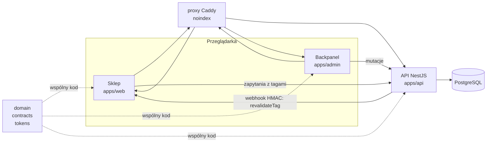

# Taktyl

Wzorcowy sklep demonstracyjny z klawiaturami, myszkami i podkładkami oraz kreatorem setu („Zbuduj set”), zbudowany jako monorepo NestJS + Next.js + PostgreSQL, w całości uruchamiany w Dockerze.

> **Taktyl jest sklepem fikcyjnym.** Nie realizuje zamówień, nie pobiera płatności (płatność to symulacja, bez pól na dane kart, kody BLIK i hasła w sklepie), nie jest indeksowany (`noindex`). Marka, firma, adresy i opinie są wymyślone.

## Co pokazuje to repozytorium

- **Architekturę w całości:** API w NestJS, sklep i backpanel w Next.js (React 19), PostgreSQL z Prisma, kontrakt w Zod, wspólna logika domeny w osobnym pakiecie.
- **Kreator setu:** klient składa klawiaturę, myszkę i podkładkę, widzi je w skali na biurku, dostaje sprawdzenie wymiarów i −10% za komplet (`docs/03`).
- **Backpanel:** edycja katalogu, cen, stanów, treści, ustawień sklepu i zamówień, z dziennikiem zmian.
- **Propagację zmian:** to, co zmienisz w backpanelu, pojawia się w sklepie w kilka sekund, bez przebudowy (ISR + odświeżanie po znacznikach, `docs/adr/0003`).
- **Dyscyplinę projektową:** wygląd wyłącznie z tokenów, ruch wyłącznie z katalogu animacji, dostępność WCAG 2.1 AA, budżet wydajności, polszczyzna przez `Intl`, kwoty w groszach.
- **Pracę z agentami:** definicje specjalistów i skilli w `.claude/`, zadania w task-managerze, każda funkcja z ID.

## Architektura



Szczegóły: `docs/14-architektura.md`, `docs/18-przeplywy.md`.

## Szybki start (Docker)

Wymagania: Docker z Compose v2 i git. Lokalny Node ani PostgreSQL nie są potrzebne.

```bash
cp .env.example .env              # uzupełnij wartości CHANGE_ME (albo: make env, losowe sekrety lokalne)
docker compose up --build         # baza, migracje, seed, API, sklep, backpanel, proxy
```

| Adres | Co |
|---|---|
| `http://taktyl.localhost` | sklep |
| `http://admin.taktyl.localhost` | backpanel |
| `http://api.taktyl.localhost` | API (`/health`, OpenAPI pod `/docs`) |

Gdy port 80 jest zajęty, ustaw `PROXY_HTTP_PORT` w `.env` (np. `8080`) i wchodź na `http://taktyl.localhost:8080`.

```bash
make dev                                              # hot reload (profil dev, kod z hosta)
docker compose --profile test run --rm test           # testy w kontenerze (Vitest, baza testowa w pamięci)
```

Skróty (`make help`): `make up`, `make dev`, `make test`, `make reset` (dane demo z `data/*.json`), `make logs`, `make down`, `make lint`, `make smoke`. CI uruchamia te same kontenery (`.github/workflows/ci.yml`). Włącz hook pre-commit: `git config core.hooksPath .githooks`.

Stan projektu: kod nie powstał jeszcze w całości, więc polecenia opisują stan docelowy (`docs/adr/0009-docker-first.md`).

## Status projektu

**Etap: dokumentacja i planowanie.** Gotowe są: dokumentacja produktu (`docs/01`–`docs/12`), dane katalogu (`data/`), tokeny i font (`assets/`), decyzje architektoniczne (`docs/adr/`), PRD i specyfikacje (`docs/13`–`docs/21`), definicje agentów i skilli. **Kod aplikacji jest w budowie** wg planu z `docs/21`. Repozytorium nie obiecuje więcej, niż w nim jest.

## Decyzje w skrócie

| Obszar | Decyzja | Dokument |
|---|---|---|
| Nazwa | **Taktyl** (od „taktylny”) | `docs/01-marka-i-nazwa.md` |
| Rdzeń oferty | Set: klawiatura + myszka + podkładka, sprawdzony wymiarami, −10% za komplet | `docs/03-kreator-setu.md` |
| Stos | NestJS 11 + Next.js 15 + PostgreSQL/Prisma + Zod, pnpm + Turborepo. ~~Astro + czysty JS~~ — **zastąpione przez ADR-0001** | `docs/adr/0001-stos-nestjs-nextjs.md` |
| Dane | `data/*.json` = seed (18 produktów, 99 wariantów, 4 sety); w runtime baza, edytowana backpanelem | `docs/adr/0005-baza-danych-i-dane-zrodlowe.md` |
| Szablon | Crafto (wariant z `docs/08` §6); jego pliki **nie są** w repozytorium | `docs/adr/0004-szablon-crafto-i-licencja.md` |
| Uruchomienie | Docker Compose, profile `dev` i `test` | `docs/adr/0009-docker-first.md` |
| Kolorystyka | Paleta jak zestaw keycapów, kobaltowy „Enter” jako jedyny akcent | `docs/06-design-system.md` |
| Font | Archivo (jedna rodzina, oś szerokości), 64 KB | `docs/06-design-system.md` |
| Ruch | Przyciski wciskają się jak klawisz; katalog A-01…A-18 | `docs/07-animacje.md` |
| Grafika | Model niczego nie rysuje; zdjęcia z manifestu, do tego czasu placeholdery | `docs/09-grafika-i-zdjecia.md` |

## Mapa dokumentacji

Kolejność czytania: `CLAUDE.md` → ten plik → `docs/01`–`docs/12` → `docs/adr/` → `docs/13`–`docs/21` → `docs/decyzje.md`.

| Dokument | Zawartość |
|---|---|
| `CLAUDE.md` | stałe reguły dla modelu, aneks po ADR |
| `docs/01-marka-i-nazwa.md` | nazwa, pozycjonowanie, PWE, odbiorcy, ton i słownik |
| `docs/02-funkcjonalnosci.md` | funkcje F-001…F-247 z priorytetami i kryteriami (stos: patrz ADR-0001) |
| `docs/03-kreator-setu.md` | kroki, reguły dopasowania, rabat, podgląd biurka |
| `docs/04-katalog-i-dane.md` | model danych, pliki `data/`, filtry, ceny, Omnibus, opisy |
| `docs/05-mapa-strony.md` | adresy, sekcje, zdarzenia |
| `docs/06-design-system.md` | tokeny, typografia, komponenty i stany |
| `docs/07-animacje.md` | katalog A-01…A-18 |
| `docs/08-szablon.md` | szablon, mapowanie stron, licencja |
| `docs/09-grafika-i-zdjecia.md` | zakaz tworzenia grafiki, manifest, placeholdery |
| `docs/10-pomiar.md` | zdarzenia e-commerce i kreatora, zgody |
| `docs/11-na-co-uwazac.md` | prawo, pułapki, czego nie robić |
| `docs/12-kryteria-odbioru.md` | scenariusze S1–S25, budżet, audyty |
| `docs/13-prd.md` | PRD: cele, zakres, metryki, ryzyka |
| `docs/14-architektura.md` | topologia, moduły, znaczniki cache |
| `docs/15-backpanel.md` | funkcje backpanelu (B-xxx) |
| `docs/16-api.md` | kontrakt API |
| `docs/17-model-danych-db.md` | schemat bazy i mapowanie z JSON |
| `docs/18-przeplywy.md` | przepływy z diagramami |
| `docs/19-repozytorium-i-publikacja.md` | higiena publicznego repo, CI, wydania |
| `docs/20-zespol-agentow-i-skille.md` | agenci, skille, praca z task-managerem |
| `docs/21-plan-wdrozenia.md` | etapy i kamienie milowe |
| `docs/adr/` | ADR-0001…0009 |
| `docs/decyzje.md` | dziennik decyzji i pytania otwarte |

## Struktura monorepo

```
apps/
  api/        NestJS: API sklepu i backpanelu, Prisma, seed
  web/        Next.js: sklep
  admin/      Next.js: backpanel
packages/
  domain/     czysta logika: grosze, rabat setu, reguły dopasowania, wysyłka, NIP, liczebniki
  contracts/  schematy Zod i typy DTO, klient HTTP
  tokens/     tokens.css bez zmian + taktyl.css
data/         seed (jedyne źródło danych początkowych), _generator.py
assets/       manifest zdjęć, tokeny, fonty Archivo (OFL)
docs/         dokumentacja i ADR
.claude/      agenci i skille projektu
podglad/      podgląd palety i animacji do obejrzenia w przeglądarce
```

Katalogi `apps/` i `packages/` powstają w kolejnych etapach (`docs/21`).

## Zasady, które pilnujemy

- **Wygląd tylko z tokenów.** Poza plikiem tokenów zero trafień `#[0-9a-fA-F]{3,8}` i `rgb(` (wyjątek: próbki z `data/colors.json`). Audyt w CI (`audyt-tokenow`).
- **Brak własnej grafiki.** Żadnych ilustracji, rysunków w CSS ani SVG, wygenerowanych ikon czy logo. Ikony z zestawu szablonu, zdjęcia z `assets/manifest.json`, w ich braku placeholdery.
- **Brak prawdziwych bytów.** Bez prawdziwych marek (także w parametrach), logotypów płatności i przewoźników, prawdziwych adresów, NIP-ów i telefonów. E-maile tylko w domenie `taktyl.example`.
- **Polszczyzna przez API:** `Intl.NumberFormat`, `Intl.PluralRules`, strefa `Europe/Warsaw`, kwoty w groszach.
- **Każda funkcja ma ID** (`F-`, `A-`, `B-`, `I-`) w commitach i komentarzach.

## Do zrobienia przez człowieka (model tego nie zrobi)

1. Kupić licencję szablonu Crafto i trzymać go lokalnie w `vendor/crafto/` (jest w `.gitignore`; `docs/adr/0004`). Bez niego repo działa na tokenach i Bootstrapie.
2. Przygotować zdjęcia według `assets/manifest.json` — w P0 to 76 obrazów (38 ujęć, 26 wycinków z góry, 12 tekstur). Do tego czasu placeholdery.
3. Dostarczyć favicon i obraz do udostępnień 1200 × 630 (to grafika).
4. Odpowiedzieć na pytania otwarte w `docs/decyzje.md` (Q-01…Q-06).
5. Opcjonalnie: sprawdzić „Taktyl” w CEIDG i KRS oraz wolność nazw w mediach społecznościowych.
6. Przy publicznym hostingu: wybrać subdomenę i ustawić nagłówek `X-Robots-Tag: noindex` (proxy robi to domyślnie).

## Licencje

- **Kod własny:** MIT (`LICENSE`).
- **Font Archivo:** SIL OFL 1.1 (`assets/fonts/OFL.txt`).
- **Szablon Crafto: nie jest częścią repozytorium** i wymaga osobnej licencji. Pliki szablonu nigdy nie trafiają do commitów.
- Dane w `data/` są fikcyjne.

## Współpraca

Zasady, ID, Definicja ukończenia i proces PR: `CONTRIBUTING.md`. Zgłoszenia bezpieczeństwa: `SECURITY.md`. Zasady zachowania: `CODE_OF_CONDUCT.md`. Proces publikacji: `docs/19-repozytorium-i-publikacja.md`.
