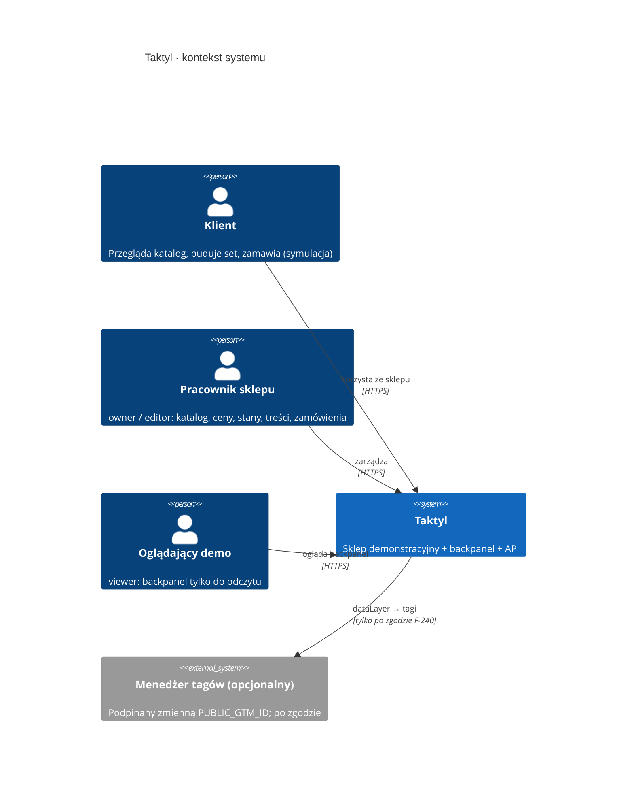
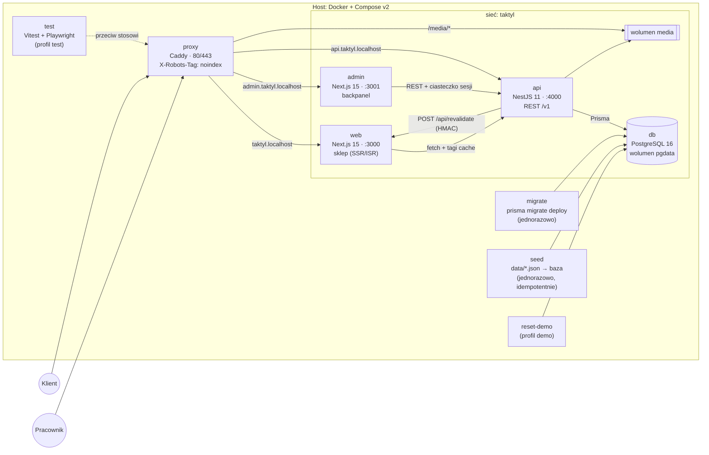

# 14 · Architektura

Dokument opisuje, jak zbudowany jest system po ADR-0001…0009. Funkcje (`F-xxx`) i ruch (`A-xx`) pozostają w `docs/02` i `docs/07`; tu jest to, co je niesie: kontenery, moduły, przepływ danych, cache, bezpieczeństwo i testy. Przedrostki ID: `B-xxx` (backpanel i API), `I-xxx` (infrastruktura) — D-001 w `docs/decyzje.md`.

## 1. Kontekst

Sklep demonstracyjny Taktyl (fikcyjny) ma trzy grupy użytkowników i jeden system:

| Aktor | Co robi | Dokąd wchodzi |
|---|---|---|
| Klient (anonimowy lub „demo”) | przegląda katalog, buduje set, składa zamówienie z symulowaną płatnością | sklep (`web`) |
| Pracownik sklepu (`owner`, `editor`) | edytuje katalog, ceny, stany, treści, ustawienia; obsługuje zamówienia | backpanel (`admin`) |
| Oglądający demo (`viewer`) | czyta backpanel bez prawa zapisu | backpanel (`admin`) |
| Człowiek-dostawca zdjęć | wgrywa pliki zgodne z `assets/manifest.json` | backpanel → moduł `media` |

Systemy zewnętrzne: **brak** (płatności, przewoźnicy, e-maile są poza zakresem — `docs/11` §4, ADR-0001). Opcjonalnie: kontener menedżera tagów podpinany zmienną `PUBLIC_GTM_ID` (`docs/10`).



## 2. Kontenery (topologia Docker Compose, ADR-0009)



| Usługa | Odpowiedzialność | Zależy od (`service_healthy`) |
|---|---|---|
| `db` | dane trwałe | — |
| `migrate` | migracje schematu | `db` |
| `seed` | dane początkowe z `data/*.json` | `migrate` |
| `api` | logika, autoryzacja, wycena, zamówienia, webhook rewalidacji | `seed` |
| `web` | strony sklepu; wywołuje `api` wewnątrz sieci (`API_URL_INTERNAL`) | `api` |
| `admin` | UI backpanelu | `api` |
| `proxy` | wejście z zewnątrz, nagłówki bezpieczeństwa, `noindex`, pliki `media` | `web`, `admin`, `api` |

Komunikacja `web → api` (renderowanie serwerowe) idzie siecią wewnętrzną. Przeglądarka klienta woła `api` tylko dla wycen i zamówień (`NEXT_PUBLIC_API_URL`, przez `proxy`).

## 3. Struktura monorepo (ADR-0002) do poziomu modułów

```
apps/
  api/src/
    main.ts · app.module.ts · config/ (walidacja env Zod)
    common/        filtry błędów (problem+json), interceptory (requestId, logi), guardy, dekoratory ról
    modules/
      auth/          logowanie, sesje, CSRF, role, tryb viewer (B-001…)
      catalog/       produkty, warianty, kategorie, przełączniki, kolory, facety, wyszukiwanie, presety
      pricing/       ceny, historia cen, lowest_30d, wycena koszyka/setu (używa packages/domain)
      inventory/     stany magazynowe, rezerwacja przy płatności, blokady wierszy
      cart-quote/    POST /cart/quote (bez cache), weryfikacja stanów
      orders/        zamówienia, numeracja TK-RRMMDD-XXXX, statusy, order_token, idempotencja
      payments-sim/  symulacja płatności (paid / failed), bez danych kart i BLIK
      content/       strony informacyjne, poradnik, opinie demo, FAQ, formularz kontaktu, newsletter
      settings/      shop.json w bazie: dostawa, kody, punkty odbioru, rabat setu, etykieta demo
      media/         wgrywanie i status zdjęć wg manifestu (wolumen media)
      audit/         audit_log, widok dziennika
      revalidation/  outbox + wysyłka webhooka HMAC do web, ponawianie
      health/        /health (liveness + readiness), opcjonalnie /metrics
    prisma/        schema.prisma, migrations/, seed/ (wczytuje data/*.json)
  web/src/app/     sklep, App Router (strony z docs/05)
  admin/src/app/   backpanel, App Router
packages/
  domain/          czysta logika: grosze, rabat setu i rozbicie, reguły dopasowania, termin wysyłki,
                   NIP, liczebniki, normalizacja wyszukiwania, filtry/facety, format pl-PL
  contracts/       schematy Zod, typy DTO, klient HTTP z typami
  tokens/          assets/tokens.css (bez zmian) + taktyl.css
```

### 3.1. Strony `apps/web` (App Router)

| Ścieżka | Typ renderowania | Dane / tagi |
|---|---|---|
| `/` | ISR | `catalog`, `presets`, `shop-settings` |
| `/[kategoria]` (klawiatury, myszki, podkladki) | RSC + wyspa kliencka filtrów; stan w adresie (F-022) | `category:{slug}`, `catalog`, `facets:{slug}` |
| `/[kategoria]/[slug]` | ISR | `product:{slug}`, `category:{slug}`, `reviews:{slug}` |
| `/zbuduj-set` | wyspa kliencka (kreator), dane startowe z RSC | `catalog`, `rules`, `presets`, `shop-settings` |
| `/koszyk`, `/zamowienie`, `/zamowienie/platnosc`, `/zamowienie/potwierdzenie`, `/zamowienie/blad-platnosci` | klient + `POST /cart/quote`, `POST /orders` (bez cache) | — |
| `/szukaj`, `/porownaj`, `/ulubione` | klient + RSC | `catalog` |
| `/konto`, `/konto/zamowienia[/id]`, `/konto/sety` | klient, `order_token` | — |
| `/poradnik`, `/poradnik/[slug]` | ISR | `content:guide`, `content:{slug}` |
| strony informacyjne (`/regulamin`, `/dostawa-i-platnosci`, …) | ISR | `content:{slug}`, `shop-settings` |
| `/404` | statyczna | — |
| `/api/revalidate` | route handler (webhook HMAC) | — |
| `/robots.txt`, `/sitemap.xml` | statyczne, `noindex` | — |

### 3.2. Strony `apps/admin`

| Ścieżka | Zawartość | ID |
|---|---|---|
| `/login` | logowanie; w `DEMO_MODE` przycisk „Wejdź jako viewer” | B-001 |
| `/` | pulpit: zamówienia do obsługi, ostatnie zmiany, brak zdjęć | B-002 |
| `/produkty`, `/produkty/[id]` | lista z filtrami, edycja produktu, warianty, ceny, stany, plakietki | B-010… |
| `/produkty/[id]/ceny` | historia cen, wyliczone `lowest_30d` (tylko odczyt) | B-0xx |
| `/zamowienia`, `/zamowienia/[numer]` | lista, szczegóły, zmiana statusu | B-0xx |
| `/tresci`, `/tresci/[slug]` | strony, poradnik, FAQ, opinie demo | B-0xx |
| `/ustawienia` | dostawa, kody rabatowe, punkty odbioru, rabat setu, etykieta demo | B-0xx |
| `/zdjecia` | status zdjęć z manifestu, wgrywanie | B-0xx |
| `/audyt` | dziennik zmian | B-0xx |
| `/uzytkownicy` | konta backpanelu (`owner`) | B-0xx |

Dokładna lista B-xxx i kryteria odbioru: `docs/15-backpanel.md`.

## 4. Przepływ danych

1. **Odczyt w sklepie:** przeglądarka → `proxy` → `web` (RSC) → `fetch(API_URL_INTERNAL/v1/…, { next: { tags } })` → `api` → `db`. Odpowiedź ląduje w cache Next (ISR); kolejne żądania nie dotykają API.
2. **Zapis w backpanelu:** `admin` → `PATCH /v1/admin/…` (ciasteczko sesji + nagłówek CSRF) → `api`: guard roli → walidacja Zod → transakcja (zmiana + `audit_log` + wiersz `outbox` ze znacznikami) → commit → worker `revalidation` wysyła webhook do `web` → `revalidateTag` → następne żądanie dostaje świeżą stronę (ADR-0003).
3. **Koszyk i wycena:** koszyk żyje w `localStorage` (ADR-0007), zawiera SKU i ilości, nie ceny. Otwarcie koszyka lub kasy → `POST /v1/cart/quote` → API liczy kwoty pakietem `domain` z bazy → klient pokazuje różnice (F-157).
4. **Zamówienie:** `POST /v1/orders` z `Idempotency-Key` → API ponownie wycenia, waliduje pola z ustawień dostawy, tworzy zamówienie `pending_payment`, zwraca `order_token` → `/zamowienie/platnosc?id=` → `payment/simulate` (`paid`/`failed`) → przy `paid` transakcja zmniejsza stany i ustawia `paid` → strona potwierdzenia wysyła `purchase` raz.
5. **Pomiar:** wyłącznie klient (`track.ts`, `docs/10`); API nie wysyła zdarzeń i nie zna `dataLayer`.

## 5. Strategia cache i ISR

| Rodzaj danych | Cache | Odświeżanie |
|---|---|---|
| Katalog, karta, listing, presety, treści | ISR, `fetch` z tagami | `revalidateTag` z webhooka; `revalidate: 300` jako sieć bezpieczeństwa |
| Wycena koszyka, stany, zamówienia | `cache: 'no-store'` | zawsze świeże |
| Facety z licznikami (F-021) | liczone przez API z uwzględnieniem aktywnych filtrów; odpowiedzi dla pustego zestawu filtrów cache’owane tagiem `facets:{kategoria}` | po zmianie katalogu |
| Dane backpanelu | brak cache po stronie serwera; TanStack Query po stronie klienta (`staleTime` 0 dla list zamówień, 30 s dla słowników) | inwalidacja po mutacji |
| Zasoby statyczne (JS, CSS, font) | `Cache-Control: public, max-age=31536000, immutable` (hash w nazwie) | nowy build |
| `media` | `max-age` 1 rok + nazwa z hashem treści | nowy plik = nowa nazwa |

Cel: zmiana w backpanelu widoczna po odświeżeniu strony w ≤ 5 s (S25, `docs/12` §7).

## 6. Tabela znaczników cache

Każda mutacja API przy zatwierdzeniu transakcji zapisuje w `outbox` poniższe znaczniki. Dodanie pola do encji bez uzupełnienia tej tabeli jest błędem przeglądu (skill `taktyl-admin-sklep-sync`).

| Encja / akcja | Znaczniki `revalidateTag` | Strony dotknięte |
|---|---|---|
| Produkt: nazwa, `short`, atrybuty, plakietki, `fit`, status | `product:{slug}`, `category:{kategoria}`, `catalog`, `facets:{kategoria}`, `presets` | karta, listing, strona główna, kreator, wyszukiwanie |
| Wariant: dodanie, usunięcie, kolor, przełącznik | jak wyżej | jak wyżej |
| Nowy produkt (bez wariantów, ukryty) | `catalog`, `category:{kategoria}`, `facets:{kategoria}` | lista w backpanelu; sklep jeszcze nic nie pokazuje |
| Produkt: usunięcie (tylko bez zamówień), zmiana `slug` | jak wiersz „Produkt” + `reviews:{slug}`; przy zmianie `slug` także znaczniki starego adresu | karta (stary i nowy adres), listing, kreator |
| Cena wariantu (nowy wpis w `price_history`) | `product:{slug}`, `category:{kategoria}`, `catalog`, `presets` | karta, listing, główna (presety z ceną setu), kreator |
| Stan magazynowy wariantu | `product:{slug}`, `category:{kategoria}`, `facets:{kategoria}` | karta, listing (dostępność, liczniki filtrów) |
| Zdjęcie (status `gotowe`/`brak`, nowy plik) | `product:{slug}`, `category:{kategoria}`, `presets` | karta, listing, kreator (DeskStage), główna |
| Kategoria (nazwa, H1, wstęp) | `category:{slug}`, `catalog` | listing, główna, nawigacja |
| Przełącznik, kolor (słowniki) | `catalog`, `facets:klawiatury`, `facets:myszki`, `facets:podkladki`, `rules` | karta, listing, kreator |
| Reguły dopasowania, profile | `rules` | kreator, karta („Dokończ set”) |
| Preset (gotowy set) | `presets` | główna, kreator |
| Ustawienia sklepu: rabat setu, próg dostawy, metody dostawy i płatności, kody, punkty odbioru, etykieta demo, godzina graniczna wysyłki, dane firmy | `shop-settings`; zmiana rabatu setu dodatkowo `presets` i `catalog` (ceny gotowych setów) | stopka, koszyk, kasa, główna, karta (dostawa i zwroty), kreator (rabat) |
| Strona informacyjna lub artykuł poradnika | `content:{slug}`, `content:guide` | ta strona, lista poradnika, główna (3 karty) |
| Opinia demo | `reviews:{slug}`, `product:{slug}` | karta produktu |
| Opis produktu (`description`) | `product:{slug}` | karta produktu |
| Pytanie FAQ | `content:faq` | strona FAQ |
| Ruch magazynowy (`stock_movements`), historia statusów zamówienia, notatka wewnętrzna (`order_notes`), płatność, pozycje zamówienia | — (stan wariantu: patrz wiersz „Stan magazynowy wariantu”) | tylko backpanel |
| Wiadomość z formularza, zapis newslettera, sesja, klucz idempotencji | — (bez tagów) | tylko backpanel |
| Zamówienie, status zamówienia | — (bez tagów); wyjątek: anulowanie z `paid`/`processing` zwraca stany, więc zapisuje `product:{slug}`, `category:{k}`, `facets:{k}`, `catalog` dotkniętych wariantów (B-205) | tylko backpanel i `konto` (no-store); po zwrocie stanu karta i listing |
| Użytkownik backpanelu, audyt | — | tylko backpanel |

`{kategoria}` to slug kategorii produktu (`klawiatury`, `myszki`, `podkladki`).

## 7. Bezpieczeństwo (OWASP Top 10)

| Zagrożenie | Środek |
|---|---|
| A01 Broken Access Control | role `owner`/`editor`/`viewer` w guardzie NestJS na każdym endpoincie `/v1/admin/*`; domyślnie zamknięte; testy e2e macierzy ról; `viewer` bez zapisu |
| A02 Cryptographic Failures | hasła argon2id; ciasteczka `HttpOnly; Secure; SameSite=Strict`; HTTPS na `proxy` poza `localhost`; sekretów brak w obrazach |
| A03 Injection | Prisma (zapytania parametryzowane); walidacja każdego wejścia schematem Zod (`contracts`), brak surowego SQL poza wyjątkami z przeglądem; sanityzacja Markdown w treściach (lista dozwolonych znaczników) |
| A04 Insecure Design | wycena i zamówienie wyłącznie po stronie serwera (ADR-0007); idempotencja; transakcje z blokadą wiersza |
| A05 Security Misconfiguration | `helmet`, CSP bez `unsafe-inline` (nonce), CORS z listą źródeł z env, `X-Robots-Tag: noindex`, wyłączony Swagger poza `NODE_ENV!=production` lub za rolą `owner` |
| A06 Vulnerable Components | Dependabot, `pnpm audit` w CI, przypięte obrazy bazowe, użytkownik nie-root |
| A07 Identification Failures | limit prób logowania (`@nestjs/throttler`: 5/min/IP+konto), sesja z odświeżaniem i unieważnianiem, brak domyślnych poświadczeń |
| A08 Integrity Failures | webhook rewalidacji podpisany HMAC-SHA256 (`X-Taktyl-Signature`, znacznik czasu ≤ 5 min, porównanie stałoczasowe); migracje tylko z repo |
| A09 Logging Failures | `audit_log` dla każdej mutacji admina; logi JSON bez danych osobowych i bez sekretów |
| A10 SSRF | API nie pobiera adresów podanych przez użytkownika; webhook tylko na `REVALIDATE_URL` z env |

Dodatkowo: CSRF — token podwójnego ciasteczka dla mutacji z backpanelu (`X-CSRF-Token`); limity żądań publicznych (`POST /orders`: 10/min/IP, `POST /cart/quote`: 60/min/IP, formularze: 5/min/IP); limit rozmiaru treści i wgrywanych plików (WebP/JPEG/PNG, ≤ 5 MB, sprawdzenie sygnatury, nie rozszerzenia); dane osobowe tylko w tabeli `orders` (ADR-0007), retencja `docs/17` §9; skan sekretów gitleaks (ADR-0008).

## 8. Obserwowalność

- Logi: JSON do stdout (pino w `api`, JSON w `web`/`admin`), pola: `ts`, `level`, `service`, `requestId`, `route`, `status`, `durationMs`, `userId` (jeśli sesja). Żadnych e-maili, telefonów, adresów, NIP-ów.
- `requestId`: generowany na `proxy`/`api` (`X-Request-Id`), przekazywany do `web` → `api`, zwracany w nagłówku i w `problem+json` (`instance`).
- `GET /health` (liveness) i `GET /health/ready` (baza, migracje zastosowane, kolejka `outbox` poniżej progu) — używane przez `healthcheck` w Compose.
- `GET /metrics` (Prometheus, opcjonalny, `METRICS_ENABLED=true`, dostęp tylko z sieci wewnętrznej): liczba żądań, czasy, długość `outbox`, nieudane webhooki.
- Alarmy lokalne: nieudane webhooki > 3 pod rząd → wpis `warn` i widget na pulpicie backpanelu (B-002).

## 9. Wydajność wobec budżetu (`docs/12` §4)

| Mechanizm | Efekt |
|---|---|
| RSC + ISR dla stron treściowych | JS ≤ 150 KB, LCP ≤ 2,0 s; HTML z cache |
| Wyspy kliencie tylko dla koszyka, kreatora, filtrów, wyszukiwarki | stron treściowych nie obciąża kod kreatora (dynamiczny import, trasy) |
| Jeden font Archivo lokalnie (`next/font/local`, 64 KB), `preload` | zero obcych domen |
| CSS: tokeny + Bootstrap 5 (tylko siatka i potrzebne komponenty, PurgeCSS) + `taktyl.css` | ≤ 60 KB na stronach treściowych |
| Obrazy: `width`/`height`, `srcset`, `fetchpriority="high"` na pierwszym ekranie, placeholdery o tych samych wymiarach | CLS ≤ 0,05 |
| Zero bibliotek animacji (`docs/07` §1) | brak kosztu JS |
| Next.js `output: 'standalone'`, kompresja na `proxy` (zstd/gzip) | mały obraz, mała transmisja |
| Pomiar | Lighthouse CI na stosie produkcyjnym Compose; progi z `docs/12` §4 jako asercje |

## 10. Dostępność i język

- Docelowo WCAG 2.1 AA (`docs/12` §6): pułapka fokusu w nakładkach, `Esc`, powrót fokusu, cele ≥ 44 × 44 px, `aria-live` tylko dla wartości końcowych, `prefers-reduced-motion`.
- Backpanel również do WCAG 2.1 AA (klawiatura, kontrasty z tokenów).
- Język: wyłącznie `pl-PL`, `<html lang="pl">`, brak warstwy i18n (bez `next-intl`). Ceny `Intl.NumberFormat('pl-PL')`, liczebniki `Intl.PluralRules('pl')`, daty `Europe/Warsaw` (reguła 7). Komunikaty błędów API są kodami (`code`); tekst po polsku składa klient wg słownika `docs/01` §4.

## 11. Konfiguracja przez zmienne środowiskowe

Plik `.env` poza repo; w repo `.env.example` z placeholderami (ADR-0008). Walidacja Zod przy starcie każdej usługi — brak lub zły format = start przerwany.

| Zmienna | Usługa | Opis | Przykład (placeholder) |
|---|---|---|---|
| `NODE_ENV` | api, web, admin | tryb | `production` |
| `POSTGRES_USER` | db, migrate, api | użytkownik bazy | `taktyl` |
| `POSTGRES_PASSWORD` | db, migrate, api | hasło bazy | `<ustaw-lokalnie>` |
| `POSTGRES_DB` | db, migrate, api | nazwa bazy | `taktyl` |
| `DATABASE_URL` | api, migrate, seed | URL bazy | `postgresql://taktyl:<haslo>@db:5432/taktyl` |
| `API_PORT` | api | port | `4000` |
| `API_URL_INTERNAL` | web, admin | adres API w sieci Compose | `http://api:4000` |
| `NEXT_PUBLIC_API_URL` | web, admin | adres API z przeglądarki | `http://api.taktyl.localhost` |
| `WEB_ORIGIN` | api | dozwolone źródło CORS (sklep) | `http://taktyl.localhost` |
| `ADMIN_ORIGIN` | api | dozwolone źródło CORS (backpanel) | `http://admin.taktyl.localhost` |
| `SESSION_SECRET` | api | podpis sesji i CSRF | `<losowy-32B>` |
| `ADMIN_BOOTSTRAP_EMAIL` | api | pierwsze konto `owner` (domena `taktyl.example`) | `owner@taktyl.example` |
| `ADMIN_BOOTSTRAP_PASSWORD` | api | hasło pierwszego konta, tylko przy pierwszym starcie | `<ustaw-lokalnie>` |
| `DEMO_MODE` | api, admin, reset-demo | przycisk viewer, reset cykliczny | `true` / `false` |
| `DEMO_RESET_CRON` | reset-demo | harmonogram resetu | `0 4 * * *` |
| `REVALIDATE_URL` | api | adres webhooka sklepu | `http://web:3000/api/revalidate` |
| `REVALIDATE_SECRET` | api, web | klucz HMAC webhooka | `<losowy-32B>` |
| `FORBIDDEN_BRANDS` | api | lista nazw prawdziwych marek (po przecinku) odrzucanych przez walidatory treści i ustawień; tylko lokalnie, nigdy w repo (reguła 5) | puste |
| `OUTBOX_WORKER_ENABLED`, `OUTBOX_POLL_MS`, `OUTBOX_BATCH_SIZE`, `REVALIDATE_TIMEOUT_MS` | api | worker outboxa: włącznik (domyślnie `true`), interwał (2000 ms), paczka wierszy (100), limit czasu webhooka (5000 ms) | `true`, `2000`, `100`, `5000` |
| `MEDIA_DIR` | api | katalog wolumenu zdjęć | `/data/media` |
| `MEDIA_PUBLIC_URL` | web, admin | prefiks adresów zdjęć | `http://taktyl.localhost/media` |
| `PUBLIC_GTM_ID` | web | opcjonalny kontener tagów (`docs/10`) | puste |
| `METRICS_ENABLED` | api | włącza `/metrics` | `false` |
| `LOG_LEVEL` | api, web, admin | poziom logów | `info` |

## 12. Strategia testów (piramida)

| Poziom | Narzędzie | Zakres | Źródło wymagań |
|---|---|---|---|
| Jednostkowe (najwięcej) | Vitest | `packages/domain`: ceny setów, reguły z `docs/03` §4.4, liczebniki, formatowanie, NIP (generowane), termin wysyłki, normalizacja `ł`, koszyk bez `localStorage` | `docs/12` §2 |
| Moduły API | Vitest + Prisma na bazie testowej w kontenerze | wycena, historia cen i `lowest_30d`, blokady stanów, idempotencja, macierz ról | ADR-0005, ADR-0007 |
| Kontrakt | Zod ↔ OpenAPI | schemat odpowiedzi = schemat w `contracts`; zmiana łamiąca = czerwone CI | `docs/16` |
| Integracyjne API | Supertest na pełnym module | endpointy publiczne i admin, `problem+json`, rate-limit | `docs/16` |
| E2E | Playwright (kontener `test`, start od `db:reset-demo`) | scenariusze S1–S24 + S25 (propagacja zmiany) | `docs/12` §1 |
| Dostępność | axe-core w Playwright + ręczna lista | każda strona P0, nakładki | `docs/12` §6 |
| Wydajność | Lighthouse CI na stosie produkcyjnym | budżet `docs/12` §4 | `docs/12` §4 |
| Audyty statyczne | skrypty: tokeny (`#hex`, `rgb(`), treść (zero „Ecomus”, `$`, lorem), zdublowane `id`, ścieżki zakazane | `CLAUDE.md` reguła 2, `docs/12` §3, §5 | CI |
| Bezpieczeństwo | gitleaks, `pnpm audit`, test nagłówków | ADR-0008 | CI |

Zasada: logika domenowa testowana raz w `domain`; e2e sprawdza przepływ i integrację, nie arytmetykę.

## 13. Technologie

| Obszar | Technologia (wersja główna) | Uzasadnienie |
|---|---|---|
| Język | TypeScript 5 (strict) | wspólne typy, mniej błędów |
| Runtime | Node.js 24 LTS | LTS, obraz `node:24-alpine` |
| Menedżer | pnpm 9, Turborepo 2 | workspaces, cache zadań |
| API | NestJS 11 | moduły, DI, guardy, pipes |
| ORM | Prisma 6 | migracje, typy, seed |
| Baza | PostgreSQL 16 | transakcje, blokady wierszy, indeksy |
| Walidacja | Zod 3, `nestjs-zod` | jeden kontrakt dla API, sklepu, backpanelu |
| Dokumentacja API | `@nestjs/swagger` (OpenAPI 3.1) | generowana z DTO |
| Auth | sesje w ciasteczku, argon2id (`argon2`) | brak tokenów w `localStorage`, odporność na XSS |
| Limity | `@nestjs/throttler` | ochrona logowania i zamówień |
| Nagłówki | `helmet` | CSP, HSTS itd. |
| Logi | `pino` (`nestjs-pino`) | JSON, szybkie |
| Sklep, backpanel | Next.js 15, React 19 | RSC, ISR, tagi cache |
| Dane po stronie klienta (admin) | TanStack Query 5, TanStack Table 8, React Hook Form 7 | standard paneli |
| UI backpanelu | Radix UI (bez stylu) + tokeny | D-002 |
| Siatka sklepu | Bootstrap 5 (tylko CSS) | `docs/06` §4 |
| Testy | Vitest 2, Playwright 1, axe-core 4, Lighthouse CI 0.14 | piramida z §12 |
| Konteneryzacja | Docker, Compose v2, Caddy 2 | ADR-0009 |
| CI | GitHub Actions + buildx | ADR-0008, ADR-0009 |

Wersje główne to cel; dokładne numery przypinane w `package.json` i obrazach przy starcie implementacji (zadanie I-xxx).
