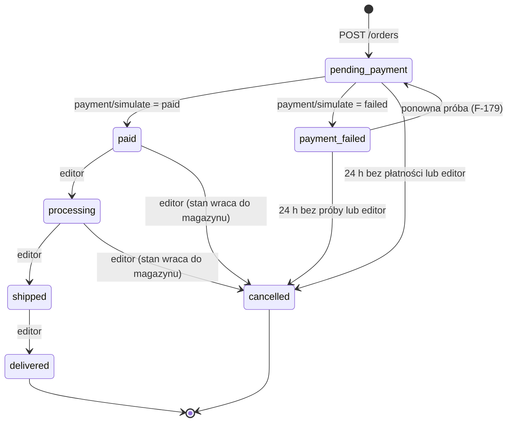

# 16 · API (kontrakt REST)

Kontrakt dla `apps/api` (NestJS). Kształty danych są zdefiniowane schematami Zod w `packages/contracts`; OpenAPI 3.1 jest z nich generowane i serwowane pod `/v1/openapi.json` (tylko poza produkcją lub dla roli `owner`). Ten dokument jest opisem zamiarów; w razie rozbieżności wygrywa `contracts`, a rozbieżność zgłasza się jako błąd dokumentacji.

Implementacja schematów: `packages/contracts/src/{shared,public,admin}` (Zod 4, C-001 w `docs/decyzje.md`). Testy kontraktowe z przykładami §6 w `packages/contracts/test`.

Powiązania: architektura `docs/14`, model danych `docs/17`, backpanel `docs/15`, funkcje `docs/02`, tagi cache `docs/14` §6, ADR-0003, ADR-0005, ADR-0006, ADR-0007.

## 1. Konwencje

| Temat | Zasada |
|---|---|
| Adres bazowy | `/v1` (przez `proxy`: `api.taktyl.localhost/v1`). Zmiana łamiąca = `/v2`, stara wersja żyje do końca cyklu |
| Format | JSON UTF-8; nagłówek `Content-Type: application/json`; daty ISO 8601 z przesunięciem (`2026-10-07T16:00:00+02:00`), serwer interpretuje czas w `Europe/Warsaw` |
| Pieniądze | **grosze, liczby całkowite**, pole z sufiksem `_gr` (`price_gr: 74900`). Brak liczb zmiennoprzecinkowych w API. Waluta zawsze `PLN` (`currency` w odpowiedziach zamówień) |
| Identyfikatory | produkt: `id` (np. `k-bazalt-75`) i `slug`; wariant: `sku`; zamówienie: `number` (`TK-RRMMDD-XXXX`) |
| Błędy | **RFC 9457 `application/problem+json`**: `type`, `title`, `status`, `code`, `detail`, `instance` (= `X-Request-Id`), opcjonalnie `errors[]` (`path`, `code`, `message`) |
| Kody błędów (`code`) | `validation_failed`, `unauthorized`, `forbidden`, `csrf_invalid`, `not_found`, `conflict`, `out_of_stock`, `price_changed`, `rate_limited`, `idempotency_conflict`, `invalid_transition`, `internal_error` — teksty po polsku składa klient |
| Paginacja | listy admina i zamówień: `?page=1&per_page=25` (maks. 100), odpowiedź `{ "items": [], "page": 1, "per_page": 25, "total": 112 }`. Katalog publiczny: kursor „Pokaż więcej” — `?limit=12&cursor=…`, odpowiedź `{ "items": [], "next_cursor": "…" | null, "total": 12 }` (F-026) |
| Sortowanie | `?sort=polecane\|cena-rosnaco\|cena-malejaco\|nowosci\|najlzejsze` (nazwy jak w `docs/04` §6); w adminie `?sort=-updated_at` |
| Filtrowanie | parametry jak w adresie sklepu (`docs/04` §6, F-022): `?rozmiar=75,tkl&lacznosc=bt&cena=30000-70000&hotswap=1&waga=do-60&dlon=19.5`. **Uwaga:** zakres `cena` w API jest w groszach (`cena=30000-70000`); sklep przelicza zł → grosze |
| Wyszukiwanie | `?q=` normalizowane po stronie serwera: małe litery, NFD bez znaków łączących, `ł → l` (`docs/04` §9) — to ta sama funkcja z `packages/domain` |
| Idempotencja | `POST /orders` wymaga nagłówka `Idempotency-Key` (UUID); ten sam klucz + to samo ciało = ta sama odpowiedź (24 h); ten sam klucz + inne ciało = `409 idempotency_conflict`. Mutacje admina: `PUT`/`PATCH`/`DELETE` idempotentne z natury |
| Współbieżność admina | edytowalne zasoby mają `version` (liczba); `PATCH` wymaga `If-Match: "<version>"`; niezgodność = `409 conflict` |
| Nagłówki | `X-Request-Id` (zwracany zawsze), `X-CSRF-Token` (mutacje admina), `Idempotency-Key`, `Cache-Control` (odpowiedzi publiczne katalogu: `public, max-age=0, must-revalidate` + `ETag`; wycena, zamówienia: `no-store`) |
| Limity | `rate_limited` (429) z `Retry-After`; wartości w `docs/14` §7 |
| Język | bez negocjacji; tylko `pl-PL` |

### 1.1. Uwierzytelnianie

- Endpointy `/v1/*` (publiczne): bez logowania. Koszyk i zamówienia identyfikuje `order_token` (zwracany w odpowiedzi `POST /orders`, klient trzyma w `localStorage`; do odczytu zamówienia wysyłany jako `X-Order-Token`).
- Endpointy `/v1/admin/*`: sesja w ciasteczku `HttpOnly; Secure; SameSite=Strict` + `X-CSRF-Token` przy mutacjach. Brak sesji = `401`, rola za niska = `403`.

### 1.2. Role (ADR-0006)

| Rola | Odczyt admina | Zapis katalogu, treści, zamówień | Ustawienia, użytkownicy, audyt, media (usuwanie) |
|---|---|---|---|
| `viewer` | tak | nie | nie (audyt: odczyt tak, użytkownicy: nie) |
| `editor` | tak | tak | ustawienia: odczyt; media: wgrywanie tak; użytkownicy i usuwanie mediów: nie |
| `owner` | tak | tak | tak |

Macierz poniżej wskazuje minimalną rolę dla każdej akcji. `viewer` może wywoływać wyłącznie `GET`.

## 2. Endpointy publiczne

Kolumny: **Role** — `—` brak wymagań; **Tagi** — znaczniki `revalidateTag` dotknięte mutacją (dla `GET` pusto, bo odczyt nie zmienia stanu); **ID** — funkcje i zadania powiązane. Kody błędów podane poza wspólnymi (`400 validation_failed`, `429 rate_limited`, `500 internal_error`).

| Metoda | Ścieżka | Role | Opis | Kody błędów | ID | Tagi |
|---|---|---|---|---|---|---|
| GET | `/v1/categories` | — | kategorie z `categories.json` (id, slug, nazwa, H1, wstęp, liczba modeli, „od X”) | — | F-020, F-002 | |
| GET | `/v1/products` | — | lista produktów kategorii z filtrami, sortowaniem, kursorem; wymagany `?category=` | 404 `not_found` (kategoria) | F-020…F-026, F-040, F-041 | |
| GET | `/v1/products/{slug}` | — | pełny produkt: atrybuty, warianty (SKU, cena, stan, `lowest_30d` gdy promocja), zdjęcia (status z manifestu), plakietki, `in_box`, `gpsr`; `?sku=` wybiera wariant | 404 | F-060…F-072, F-078 | |
| GET | `/v1/products/{slug}/complete-set` | — | propozycja „Dokończ set”: dwie pozostałe kategorie dobrane wg `fit`, cena setu z rabatem; opcjonalnie `?profile=` i `?sku=` (API-004) | 404 | F-069 | |
| GET | `/v1/facets` | — | facety kategorii z licznikami przy wartościach, liczonymi z aktywnymi filtrami (te same parametry co `/products`); wartości z zerem wyników oznaczone `disabled: true` | 404 | F-021, F-029 | |
| GET | `/v1/search` | — | wyszukiwanie (`q`, `limit`): produkty, kategorie, poradniki; normalizacja `ł`; synonimy (F-006) | — | F-005…F-007 | |
| GET | `/v1/switches` | — | przełączniki (`switches.json`) | — | F-062, F-074 | |
| GET | `/v1/colors` | — | kolory z próbkami (`swatch`) | — | F-062, F-115 | |
| GET | `/v1/rules` | — | profile, strefy myszki, reguły dopasowania i komunikaty (`rules.json`) | — | F-101, F-104 | |
| GET | `/v1/presets` | — | gotowe sety z ceną policzoną **na bieżąco** (suma, rabat, razem w groszach) | — | F-111, `docs/05` §2 | |
| GET | `/v1/shop-settings` | — | ustawienia publiczne: próg dostawy, rabat setu, metody dostawy i płatności, kody (tylko etykiety, bez logiki), punkty odbioru, `returns_days`, etykieta demo, dane fikcyjnej firmy | — | F-001, F-009, F-073, F-153 | |
| GET | `/v1/shipping-estimate` | — | termin wysyłki i dostawy (`?method=kurier`), liczone `domain` w strefie `Europe/Warsaw` | 404 (metoda) | F-065 | |
| GET | `/v1/pickup-points` | — | punkty odbioru; `?city=` filtruje | — | F-172 | |
| POST | `/v1/cart/quote` | — | **wycena koszyka bez cache**: pozycje i grupy setów → ceny, rabat setu, kod, dostawa, razem, problemy (brak towaru, zmiana ceny) | 422 `validation_failed`; 404 `not_found` (nieznany SKU zwracany jako problem pozycji, nie błąd HTTP) | F-150…F-157, F-024 | |
| POST | `/v1/orders` | — (`Idempotency-Key`) | utworzenie zamówienia `pending_payment`; ponowna wycena po stronie serwera; zwraca `order_token` | 409 `out_of_stock`, 409 `price_changed`, 409 `idempotency_conflict`, 422 `validation_failed` (pola wg metody dostawy, NIP, kod pocztowy, telefon) | F-170…F-176, F-180 | `product:{slug}`* |
| GET | `/v1/orders/{number}` | `X-Order-Token` | odczyt zamówienia właściciela tokenu | 401, 404 | F-178, F-202 | |
| POST | `/v1/orders/{number}/payment/simulate` | `X-Order-Token` | symulacja: `{ "outcome": "paid" \| "failed" }`; `paid` zmniejsza stany i ustawia `paid`; `failed` zapisuje `payment_failed` | 404, 409 `invalid_transition`, 409 `out_of_stock` (stan zmienił się w trakcie) | F-177…F-179 | `product:{slug}`, `category:{kategoria}`, `facets:{kategoria}`** |
| GET | `/v1/orders` | `X-Order-Token` (jeden lub wiele, rozdzielone przecinkami) | lista zamówień dla „konta demo” | 401 | F-201, F-202 | |
| GET | `/v1/content/pages/{slug}` | — | strona informacyjna lub prawna (z oznaczeniem „wzór”) | 404 | F-221, `docs/05` §8 | |
| GET | `/v1/content/guides` | — | lista artykułów poradnika | — | F-220 | |
| GET | `/v1/content/guides/{slug}` | — | artykuł poradnika | 404 | F-220 | |
| GET | `/v1/content/faq` | — | pytania i odpowiedzi | — | F-221 | |
| GET | `/v1/products/{slug}/reviews` | — | opinie demo z etykietą i średnią (`avg`, `count`); bez danych strukturalnych | 404 | F-076 | |
| POST | `/v1/forms/contact` | — | formularz kontaktu (e-mail, temat, wiadomość); w demo nic nie jest wysyłane, wiadomość zapisana do backpanelu | 422 | F-221, `generate_lead` | |
| POST | `/v1/forms/newsletter` | — | zapis e-maila (jedno pole); zgoda nie jest zaznaczona z góry po stronie UI | 422 | F-223, `generate_lead` | |
| GET | `/health`, `/health/ready` | — | liveness i readiness (poza `/v1`) | 503 | I-xxx | |

\* `POST /orders` nie zmienia stanów magazynowych (zmniejsza je dopiero płatność `paid`), więc nie rewaliduje tagów; gwiazdka oznacza brak.
\*\* Zmniejszenie stanu przy `paid` unieważnia karty i listingi dotkniętych produktów.

Pozostałe endpointy `GET` zwracają `ETag`; sklep może używać warunkowych żądań.

## 3. Endpointy admin (`/v1/admin/*`)

Minimalna rola w kolumnie **Rola**. Wszystkie `POST`/`PUT`/`PATCH`/`DELETE` wymagają `X-CSRF-Token`, zapisują wpis w `audit_log` i wiersz `outbox` ze znacznikami z kolumny **Tagi** (`docs/14` §6). Wspólne kody błędów: `401`, `403 forbidden`, `403 csrf_invalid`, `404 not_found`, `409 conflict` (`If-Match`), `422 validation_failed`.

### 3.1. Sesja i użytkownicy

| Metoda | Ścieżka | Rola | Opis | Kody | ID | Tagi |
|---|---|---|---|---|---|---|
| POST | `/v1/admin/auth/login` | — | e-mail + hasło; ustawia ciasteczko sesji; limit prób | 401, 429 | B-001 | |
| POST | `/v1/admin/auth/demo-viewer` | — | tylko gdy `DEMO_MODE=true`: sesja `viewer` bez hasła | 404 (gdy wyłączone) | B-001 | |
| POST | `/v1/admin/auth/logout` | viewer | kończy sesję | — | B-001 | |
| GET | `/v1/admin/auth/me` | viewer | bieżący użytkownik i rola, token CSRF | 401 | B-001 | |
| GET | `/v1/admin/users` | owner | lista kont | — | B-0xx | |
| POST | `/v1/admin/users` | owner | nowe konto (e-mail, rola, hasło początkowe) | 409 (duplikat e-maila) | B-0xx | |
| PATCH | `/v1/admin/users/{id}` | owner | zmiana roli, dezaktywacja, reset hasła | 409 (nie można odebrać roli ostatniemu `owner`) | B-0xx | |

### 3.2. Katalog: produkty, warianty, ceny, stany

| Metoda | Ścieżka | Rola | Opis | Kody | ID | Tagi |
|---|---|---|---|---|---|---|
| GET | `/v1/admin/products` | viewer | lista (filtry: kategoria, status, brak zdjęcia, niski stan; wyszukiwanie) | — | B-010 | |
| GET | `/v1/admin/products/{id}` | viewer | produkt z wariantami, stanami, historią cen, zdjęciami | — | B-011 | |
| POST | `/v1/admin/products` | editor | nowy produkt (atrybuty zgodne ze schematem kategorii) | 409 (zajęty `slug`) | B-012 | `catalog`, `category:{k}`, `facets:{k}` |
| PATCH | `/v1/admin/products/{id}` | editor | nazwa, `short`, atrybuty, plakietki, `fit`, `in_box`, `gpsr`, status (`active` / `archived`) | 409 | B-011 | `product:{slug}`, `category:{k}`, `catalog`, `facets:{k}`, `presets` |
| DELETE | `/v1/admin/products/{id}` | owner | twarde usunięcie tylko bez zamówień; inaczej `409` (użyj archiwizacji) | 409 | B-012 | j.w. |
| POST | `/v1/admin/products/{id}/variants` | editor | nowy wariant (SKU wg wzoru `docs/04` §3.1, kolor, przełącznik lub rozmiar, cena, stan) | 409 (zajęty SKU), 422 (SKU niezgodny ze wzorem) | B-013 | `product:{slug}`, `category:{k}`, `facets:{k}`, `presets` |
| PATCH | `/v1/admin/variants/{sku}` | editor | kolor, przełącznik, rozmiar, `images`, dostępność | 409 | B-013 | j.w. |
| DELETE | `/v1/admin/variants/{sku}` | owner | usunięcie (tylko bez zamówień), inaczej wyłączenie | 409 | B-013 | j.w. |
| PUT | `/v1/admin/variants/{sku}/price` | editor | ustawia nową cenę: `{ "price_gr": 74900, "regular_price_gr": null }`; **dopisuje wpis do `price_history`**; `lowest_30d` wylicza serwer (brak pola ręcznego) | 422 (`price_gr` ≤ 0 lub nie całkowita) | B-014 | `product:{slug}`, `category:{k}`, `catalog`, `presets` |
| GET | `/v1/admin/variants/{sku}/price-history` | viewer | historia cen, wyliczone `lowest_30d` i okno obliczenia | — | B-014 | |
| PUT | `/v1/admin/variants/{sku}/stock` | editor | `{ "stock": 12, "reason": "korekta" }`; zapis ruchu magazynowego | 422 (ujemny stan) | B-015 | `product:{slug}`, `category:{k}`, `facets:{k}` |
| GET | `/v1/admin/variants/{sku}/stock-movements` | viewer | historia ruchów (korekta, sprzedaż, anulowanie) | — | B-015 | |
| GET | `/v1/admin/presets` | viewer | gotowe sety | — | B-016 | |
| PUT | `/v1/admin/presets/{id}` | editor | skład (3 SKU), nazwa, notatka, profil; cena liczona, nie edytowalna | 422 (skład spoza trzech kategorii) | B-016 | `presets` |
| GET | `/v1/admin/categories` | viewer | kategorie | — | B-017 | |
| PATCH | `/v1/admin/categories/{id}` | editor | nazwa, H1, wstęp, kolejność | — | B-017 | `category:{slug}`, `catalog` |
| PATCH | `/v1/admin/switches/{id}`, `/v1/admin/colors/{id}` | editor | edycja słownika (etykieta, opis, `swatch`) | 422 | B-017 | `catalog`, `facets:*`, `rules` |
| PATCH | `/v1/admin/rules` | owner | profile i parametry reguł dopasowania (`rules.json`) | 422 (nieznana reguła) | B-018 | `rules` |

### 3.3. Zamówienia

| Metoda | Ścieżka | Rola | Opis | Kody | ID | Tagi |
|---|---|---|---|---|---|---|
| GET | `/v1/admin/orders` | viewer | lista z filtrami (status, data, numer, metoda płatności); dane osobowe maskowane dla `viewer` | — | B-020 | |
| GET | `/v1/admin/orders/{number}` | viewer | szczegóły: pozycje, rabaty, dostawa, płatność, historia statusów | 404 | B-021 | |
| POST | `/v1/admin/orders/{number}/transition` | editor | `{ "to": "shipped", "note": "…" }`; dozwolone przejścia wg §5 | 409 `invalid_transition` | B-022 | `product:{slug}`, `category:{k}`, `facets:{k}` (tylko przy anulowaniu zwracającym stan) |
| POST | `/v1/admin/orders/{number}/note` | editor | notatka wewnętrzna | — | B-022 | |

### 3.4. Treści

| Metoda | Ścieżka | Rola | Opis | Kody | ID | Tagi |
|---|---|---|---|---|---|---|
| GET | `/v1/admin/content` | viewer | strony, artykuły, FAQ (filtr typu) | — | B-030 | |
| GET | `/v1/admin/content/{id}` | viewer | pojedyncza treść | — | B-030 | |
| POST | `/v1/admin/content` | editor | nowa strona/artykuł (Markdown ograniczony, `slug`, typ, status) | 409 (zajęty slug) | B-031 | `content:{slug}`, `content:guide` |
| PATCH | `/v1/admin/content/{id}` | editor | edycja, publikacja, cofnięcie do szkicu | 409 | B-031 | `content:{slug}`, `content:guide` |
| DELETE | `/v1/admin/content/{id}` | owner | usunięcie (strony prawne tylko archiwizacja) | 409 | B-031 | j.w. |
| GET | `/v1/admin/reviews` | viewer | opinie demo | — | B-032 | |
| PUT | `/v1/admin/products/{id}/reviews` | editor | zestaw opinii demo produktu (3–6, oceny 3–5, `demo: true` wymuszone) | 422 | B-032 | `reviews:{slug}`, `product:{slug}` |
| GET | `/v1/admin/messages` | viewer | wiadomości z formularza kontaktu i zapisy newslettera | — | B-033 | |

### 3.5. Ustawienia, media, audyt

| Metoda | Ścieżka | Rola | Opis | Kody | ID | Tagi |
|---|---|---|---|---|---|---|
| GET | `/v1/admin/settings` | viewer | cały `shop.json` w bazie | — | B-040 | |
| PATCH | `/v1/admin/settings` | owner | rabat setu (procent, kategorie), próg dostawy, metody dostawy i płatności, kody rabatowe, punkty odbioru, etykieta demo | 422 (np. procent poza 0–50) | B-040 | `shop-settings`, `presets` |
| GET | `/v1/admin/media` | viewer | lista z manifestu: `key`, rodzaj, wymiary, priorytet, status | — | B-050 | |
| POST | `/v1/admin/media/{key}` | editor | wgranie pliku dla klucza manifestu (multipart); walidacja typu, wymiarów zgodnych z `pixels`, rozmiaru; ustawia `status: gotowe` | 415 (typ), 422 (wymiary niezgodne z manifestem), 413 | B-051 | `product:{slug}`, `category:{k}`, `presets` |
| DELETE | `/v1/admin/media/{key}` | owner | usunięcie pliku, `status: brak` (wraca placeholder) | — | B-051 | j.w. |
| GET | `/v1/admin/audit` | viewer | dziennik: kto, kiedy, encja, `before`/`after`; filtry | — | B-060 | |
| GET | `/v1/admin/dashboard` | viewer | liczby: zamówienia do obsługi, niskie stany, brakujące zdjęcia, nieudane webhooki | — | B-002 | |
| POST | `/v1/admin/revalidate` | owner | ręczne wysłanie znaczników (diagnostyka); `{ "tags": ["catalog"] }` | 422 | B-061 | podane |

### 3.6. Wewnętrzny webhook (api → web)

| Metoda | Ścieżka (w `web`) | Uwierzytelnienie | Opis |
|---|---|---|---|
| POST | `/api/revalidate` | `X-Taktyl-Signature` = HMAC-SHA256(`REVALIDATE_SECRET`, `timestamp + "." + body`), `X-Taktyl-Timestamp` ≤ 5 min | `{ "tags": ["product:bazalt-75","catalog"] }` → `revalidateTag` dla każdego; odpowiedź `{ "revalidated": [...] }`; `401` gdy podpis zły |

## 4. Reguły autoryzacji (skrót testowalny)

1. Każdy endpoint `/v1/admin/*` ma jawny dekorator roli; brak dekoratora = start aplikacji przerwany w testach.
2. `viewer`: dozwolone wyłącznie `GET`; dane osobowe w zamówieniach zamaskowane (`a***@taktyl.example`, `+48 ** *** 00 00`).
3. `editor` nie widzi i nie zmienia `settings`, użytkowników ani reguł dopasowania; widzi audyt.
4. `owner` jako jedyny usuwa produkty/media/treści oraz zarządza użytkownikami; nie można odebrać roli ostatniemu `owner`.
5. Każda odmowa zapisuje wpis `warn` w logu (bez danych osobowych).
6. Publiczne zamówienia dostępne wyłącznie z poprawnym `X-Order-Token`; numer zamówienia sam w sobie nie daje dostępu.

## 5. Maszyna stanów zamówienia



| Przejście | Kto | Skutek uboczny |
|---|---|---|
| `pending_payment → paid` | system (symulacja) | zmniejszenie stanów w jednej transakcji z blokadą wierszy; ruch magazynowy `sale`; jeśli brak stanu — `409 out_of_stock`, status bez zmian |
| `pending_payment → payment_failed` | system | wpis w historii; koszyk po stronie klienta nie jest czyszczony |
| `payment_failed → pending_payment` | klient („Spróbuj ponownie”) | brak |
| `paid/processing → cancelled` | editor | zwrot stanów (`sale_reverted`) |
| `pending_payment/payment_failed → cancelled` | system po 24 h lub editor | brak ruchu magazynowego (stan nie był zdjęty) |
| `paid → processing → shipped → delivered` | editor | zapis w `order_status_history`; brak wysyłki e-maili (demo) |

Każda zmiana: wpis w `order_status_history` (`from`, `to`, `actor`, `note`, `at`) i w `audit_log`. Niedozwolone przejście = `409 invalid_transition`.

## 6. Przykłady

### 6.1. `POST /v1/cart/quote`

Żądanie (koszyk z `docs/03` §7: set + osobna pozycja; ceny nie są wysyłane):

```json
{
  "items": [
    { "type": "set", "id": "set-1696676400000", "qty": 1, "profile": "programowanie",
      "skus": ["K-BZL75-GRF-PRG", "M-PST-GRF", "P-SZR-XL-GRF"] },
    { "type": "item", "sku": "P-TFL-M-GRF", "qty": 1 }
  ],
  "coupon": "TAKTYL10",
  "shipping_method": null
}
```

Odpowiedź `200` (kwoty w groszach; wartości z `data/products.json` i `shop.json`, wynik spójny z S14 w `docs/12`):

```json
{
  "currency": "PLN",
  "lines": [
    { "type": "set", "id": "set-1696676400000", "qty": 1,
      "items": [
        { "sku": "K-BZL75-GRF-PRG", "name": "Bazalt 75", "price_gr": 74900, "set_discount_gr": 7490, "stock": 24, "available": true },
        { "sku": "M-PST-GRF",       "name": "Pustułka",  "price_gr": 39900, "set_discount_gr": 3990, "stock": 10, "available": true },
        { "sku": "P-SZR-XL-GRF",    "name": "Szron",     "price_gr": 18900, "set_discount_gr": 1890, "stock": 35, "available": true }
      ],
      "subtotal_gr": 133700, "set_discount_gr": 13370, "total_gr": 120330 },
    { "type": "item", "sku": "P-TFL-M-GRF", "name": "Tafla", "qty": 1, "price_gr": 6900,
      "coupon_discount_gr": 690, "stock": 33, "available": true }
  ],
  "summary": {
    "products_gr": 140600, "set_discount_gr": 13370, "coupon_discount_gr": 690,
    "shipping_from_gr": 1299, "total_gr": 126540, "free_shipping_remaining_gr": 0
  },
  "coupon": { "code": "TAKTYL10", "applied": true, "message_code": "coupon_applies_outside_sets" },
  "problems": []
}
```

Rozbicie rabatu setu na pozycje: `floor(cena_i · rabat / suma)`, reszta groszy na ostatnią pozycję (`docs/03` §6): 7 490 + 3 990 + 1 890 = 13 370. `products_gr` to wartość produktów przed rabatami (133 700 + 6 900 = 140 600); `total_gr` = 140 600 − 13 370 − 690 = 126 540 (dostawa 0, bo ≥ 299 zł). Kod `TAKTYL10` obejmuje wyłącznie pozycje spoza setów (F-153). `problems[]` zawiera obiekty `{ "sku", "code": "out_of_stock" | "price_changed" | "unknown_sku", "available_qty"?: n }`; przy `out_of_stock` odpowiedź nadal jest `200` (klient decyduje, F-157).

### 6.2. `POST /v1/orders`

Nagłówki: `Idempotency-Key: 6f1c0c3e-…` (UUID).

Żądanie (kurier, koszyk z samym setem: razem 1203,30 zł ≥ progu 299 zł, więc dostawa darmowa i `shipping_gr: 0`; pola z `shop.json → shipping_methods[].fields`, dane przykładowe tylko w domenie `taktyl.example`):

```json
{
  "items": [
    { "type": "set", "id": "set-1696676400000", "qty": 1, "profile": "programowanie",
      "skus": ["K-BZL75-GRF-PRG", "M-PST-GRF", "P-SZR-XL-GRF"] }
  ],
  "coupon": null,
  "contact": { "email": "jan@taktyl.example", "phone": "500000000" },
  "shipping": {
    "method": "kurier",
    "name": "Jan Przykładowy",
    "street": "ul. Przykładowa 1",
    "postcode": "00-000",
    "city": "Warszawa"
  },
  "invoice": null,
  "payment_type": "blik",
  "consents": { "terms": true, "newsletter": false },
  "expected_total_gr": 120330
}
```

Odpowiedź `201`:

```json
{
  "number": "TK-261007-A7B2",
  "status": "pending_payment",
  "order_token": "<losowy-token-do-przechowania-w-przegladarce>",
  "currency": "PLN",
  "items_total_gr": 120330,
  "shipping_gr": 0,
  "total_gr": 120330,
  "payment": { "type": "blik", "simulate_url": "/zamowienie/platnosc?id=TK-261007-A7B2" },
  "eta": { "dispatch_date": "2026-10-07", "delivery_date": "2026-10-08" }
}
```

Reguły:

- `expected_total_gr` to suma, którą klient pokazał użytkownikowi. Gdy serwer wyliczy inną — `409 price_changed` z nową wyceną w `detail`/`errors[]`; zamówienie nie powstaje.
- Brak towaru w którymkolwiek SKU — `409 out_of_stock` z listą SKU (`errors[].path = items[n].sku`).
- Pola adresowe wymagane tylko dla metod, które je mają w `shop_settings`; dla `automat` pole `point` (id z `pickup_points`) i brak pól adresu (S17).
- NIP (jeśli `invoice` podane) walidowany sumą kontrolną w `domain` (S18); błędny — `422` z `errors[].path = invoice.nip`.
- `consents.terms` musi być `true`; `consents.newsletter` jest opcjonalne i domyślnie `false`.
- Dane kart, kody BLIK i hasła **nie istnieją w kontrakcie** (reguła 10); walidator odrzuca nieznane pola (`strict`).
- Ponowne wysłanie tego samego `Idempotency-Key` i ciała zwraca `201` z tym samym numerem (bez drugiego zamówienia).

### 6.3. `POST /v1/orders/{number}/payment/simulate`

Żądanie: `{ "outcome": "failed" }` → odpowiedź `200` `{ "status": "payment_failed", "transaction_id": "TK-261007-A7B2" }`; potem `{ "outcome": "paid" }` → `{ "status": "paid", "transaction_id": "TK-261007-A7B2" }`. `transaction_id` jest numerem zamówienia (ten sam klucz używa `purchase` w `docs/10`).

## 7. Zgodność ze zdarzeniami pomiaru

API nie wysyła zdarzeń. Odpowiedzi dają klientowi wszystko, co potrzeba do `docs/10`: ceny jednostkowe i `discount` per pozycja (`set_discount_gr`), `value` (po rabacie setu, bez dostawy), `shipping_gr`, VAT zawarty w cenie liczony przez klienta jako `value · 23 / 123`. Dane osobowe nie występują w odpowiedziach używanych przez pomiar.

## 8. Wersjonowanie i zmiany

- Zmiana dodająca pole opcjonalne: w ramach `/v1`.
- Zmiana usuwająca lub zmieniająca znaczenie pola: `/v2` i okres przejściowy.
- Każda zmiana kontraktu = zmiana schematu Zod w `contracts`, aktualizacja tego dokumentu i testu kontraktowego (skill `taktyl-admin-sklep-sync`).
