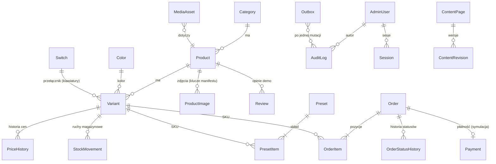

# 17 · Model danych (PostgreSQL + Prisma)

Specyfikacja schematu dla `apps/api/prisma`. Podstawa: ADR-0005 (baza i status `data/*.json`), ADR-0007 (zamówienia), ADR-0003 (outbox), ADR-0006 (użytkownicy). Model produktu z `docs/04` §3 jest zachowany; dochodzą encje potrzebne backpanelowi i zamówieniom. Szkice Prisma niżej to **specyfikacja, nie implementacja**: nazwy i typy są zobowiązujące, szczegóły składni uzupełnia implementacja.

## 1. Zasady

| Zasada | Treść |
|---|---|
| Pieniądze | **grosze, `Int`** (kolumny z sufiksem `_gr`). W seedzie: `Math.round(zł · 100)` raz, przy wczytaniu `data/*.json`. Brak `Decimal` i `Float` dla kwot |
| Czas | `timestamptz` (UTC w bazie); reguły biznesowe (dzień roboczy, 14:00, numer zamówienia `RRMMDD`) liczone w `Europe/Warsaw` w `packages/domain` |
| Identyfikatory | wartości z danych (`id` produktu, `sku`, `slug`) jako klucze naturalne tam, gdzie są stabilne; reszta `cuid`/UUID |
| Atrybuty produktu | `JSONB`, walidowane schematem Zod **per kategoria** (`docs/04` §4); kolumny relacyjne tylko dla pól filtrowanych/sortowanych często |
| Usuwanie | produkty i warianty z zamówieniami: tylko archiwizacja (`status`); twarde usunięcie bez zamówień (ADR-0005) |
| Wersjonowanie edycji | kolumna `version Int` na edytowalnych encjach (`If-Match`, `docs/16` §1) |
| Dane osobowe | tylko w `orders` (i wiadomościach formularzy); patrz §9 |
| Marki | brak encji „marka”: `brand` zawsze `Taktyl` (reguła 5) |

## 2. Relacje



## 3. Tabele

Typy: `Int`, `Text`, `Bool`, `Json` (JSONB), `Ts` (timestamptz). `PK` klucz główny, `FK` klucz obcy, `UQ` unikalny.

### 3.1. Katalog

**`categories`**

| Kolumna | Typ | Null | Uwagi |
|---|---|---|---|
| `id` | Text PK | nie | `klawiatury`, `myszki`, `podkladki` |
| `slug` | Text UQ | nie | j.w. |
| `name` | Text | nie | „Klawiatury” |
| `h1` | Text | nie | |
| `intro` | Text | nie | wstęp, 2 zdania |
| `position` | Int | nie | pole `order` z JSON |
| `version`, `updated_at` | Int, Ts | nie | |

**`colors`** (słownik, `colors.json`)

| Kolumna | Typ | Null | Uwagi |
|---|---|---|---|
| `id` | Text PK | nie | `grafit`, `mgla`, `kobalt`, `naturalny` |
| `code` | Text UQ | nie | `GRF`, `MGL`, `KOB`, `NAT` (część SKU) |
| `label` | Text | nie | |
| `harmony` | Text | nie | reguła `color-harmony` |
| `swatch` | Text | nie | wartość próbki; **jedyny dozwolony kolor poza tokenami** (reguła 2) — przechowywana jako dane, nie w CSS |

**`switches`** (słownik, `switches.json`)

| Kolumna | Typ | Null | Uwagi |
|---|---|---|---|
| `id` | Text PK | nie | `slizg`, `prog`, `trzask`, `szept` |
| `code` | Text UQ | nie | `SLZ`, `PRG`, `TRZ`, `SZP` |
| `name`, `type`, `type_label` | Text | nie | typ: liniowy, taktylny, klikający, cichy liniowy (facet `przelacznik`) |
| `force_g` | Int | nie | siła nacisku |
| `sound` | Text | nie | |
| `summary` | Text | nie | |

**`products`**

| Kolumna | Typ | Null | Uwagi |
|---|---|---|---|
| `id` | Text PK | nie | np. `k-bazalt-75` |
| `slug` | Text UQ | nie | adres: `/klawiatury/bazalt-75` |
| `category_id` | Text FK | nie | → `categories.id` |
| `name` | Text | nie | |
| `brand` | Text | nie | stała `Taktyl` (CHECK) |
| `short` | Text | nie | |
| `description` | Text | tak | z `descriptions.json` (pisze model wg `docs/04` §7, zatwierdza człowiek) |
| `attributes` | Json | nie | atrybuty wg kategorii (`docs/04` §4); zawiera `dims_mm`, `weight_g`, `hand_cm` itd. |
| `options` | Text[] | nie | `["color","switch"]`, `["color"]`, `["size","color"]` |
| `default_variant_sku` | Text FK | tak | → `variants.sku` (ustawiane po utworzeniu wariantów) |
| `badges` | Text[] | nie | `nowosc`, `bestseller` (plakietki „Promocja”, „Ostatnie sztuki”, „Brak” wynikają z danych, nie są przechowywane) |
| `fit` | Json | nie | `{ fps, gry, programowanie, biuro, cisza }`, wartości 0–3 |
| `in_box` | Text[] | nie | pusta lista = sekcja ukryta |
| `gpsr` | Json | nie | producent, adres, kontakt, ostrzeżenia (dane fikcyjne, domena `taktyl.example`) |
| `status` | Text | nie | `active` \| `archived` |
| `version`, `created_at`, `updated_at` | Int, Ts, Ts | nie | |

Indeksy: `(category_id, status)`, GIN na `attributes` (filtry atrybutowe), `(slug)`.

**`variants`**

| Kolumna | Typ | Null | Uwagi |
|---|---|---|---|
| `sku` | Text PK | nie | wzory `docs/04` §3.1: `K-…`, `M-…`, `P-…` (CHECK regex per kategoria) |
| `product_id` | Text FK | nie | |
| `color_id` | Text FK | nie | → `colors.id` |
| `switch_id` | Text FK | tak | tylko klawiatury |
| `size_key` | Text | tak | tylko podkładki: `m`, `l`, `xl`, `xxl` (klucz w `attributes.sizes`: `w`, `d`, `type`, `label`) |
| `price_gr` | Int | nie | **bieżąca cena** (kopia ostatniego wpisu `price_history`, dla szybkich odczytów) |
| `regular_price_gr` | Int | tak | wewnętrzna; **nigdy** nie wyświetlana jako przekreślona (`docs/04` §5.2) |
| `stock` | Int | nie | CHECK `stock >= 0` |
| `images_key` | Text | nie | klucz koloru w `product_images` (`images` z JSON) |
| `status` | Text | nie | `active` \| `disabled` |
| `version`, `updated_at` | Int, Ts | nie | |

`lowest_30d` **nie jest kolumną** — wylicza się z `price_history` (§5). Indeksy: `(product_id)`, `(color_id)`, `(switch_id)`, `(product_id, status)`; UQ `(product_id, color_id, switch_id, size_key)` (z `NULLS NOT DISTINCT`).

**`product_images`** (klucze z `assets/manifest.json`, `docs/09`)

| Kolumna | Typ | Null | Uwagi |
|---|---|---|---|
| `key` | Text PK | nie | np. `k-kwarc-60_grafit_01-34`, `k-kwarc-60_grafit_top`, `p-tafla_grafit_tekstura` |
| `product_id` | Text FK | nie | |
| `color_id` | Text FK | nie | |
| `kind` | Text | nie | `packshot` \| `topdown` \| `texture` |
| `shot` | Text | tak | `01-34`, `02-gora`, `03-bok`, `04-detal` |
| `description` | Text | tak | do tekstu alternatywnego (`docs/09` §4.4) |
| `priority` | Text | nie | `P0` \| `P1` |
| `status` | Text | nie | `brak` \| `gotowe` |
| `files` | Text[] | nie | ścieżki z manifestu |
| `dims_mm`, `pixels` | Json | tak | wymiary i piksele; walidacja przy wgraniu pliku (`docs/16`) |
| `updated_at` | Ts | nie | |

**`presets`** i **`preset_items`**

| Tabela | Kolumny |
|---|---|
| `presets` | `id` PK (`programista`, `fps`, `open-space`, `kobalt`), `name`, `profile`, `note`, `position`, `version`, `updated_at` |
| `preset_items` | `preset_id` FK, `category_id` FK, `sku` FK → `variants.sku`; PK `(preset_id, category_id)` |

Pól `sum`, `set_discount`, `total` z `presets.json` **nie przechowujemy**: serwer liczy je z aktualnych cen (kontrola: wartości z seedu muszą wyjść co do grosza, `docs/12` §2).

**`rule_settings`** (`rules.json`, jeden wiersz)

| Kolumna | Typ | Uwagi |
|---|---|---|
| `id` | Text PK | stała `default` |
| `units` | Text | `mm` |
| `profiles` | Json | profile: `label`, `mouse_zone_mm`, `default_switch` |
| `no_profile` | Json | strefa 260 mm i komunikat |
| `gap_keyboard_mouse_mm`, `edge_margin_mm` | Int | 30, 20 |
| `checks` | Json | reguły i szablony komunikatów |
| `suggestion_order` | Json | kolejność propozycji zmian (`rules.json`) |
| `never_block` | Bool | reguły nigdy nie blokują zamówienia |
| `version`, `updated_at` | Int, Ts | |

**`facet_definitions`** (`facets.json`): `category_id`, `id`, `label`, `type` (`multi`/`range`/`bool`/`buckets`/`number-match`), `attr`, `values` (Json, null), `unit` (null), `hint` (null), `position`; PK `(category_id, id)`.

### 3.2. Ustawienia sklepu

**`shop_settings`** (`shop.json`, jeden wiersz `default`)

| Kolumna | Typ | Uwagi |
|---|---|---|
| `currency`, `locale`, `timezone` | Text | `PLN`, `pl-PL`, `Europe/Warsaw` |
| `free_shipping_threshold_gr` | Int | 29900 |
| `set_discount_percent` | Int | 10 |
| `set_discount_categories` | Text[] | trzy kategorie |
| `dispatch_cutoff_hour` | Int | 14 |
| `returns_days`, `statutory_withdrawal_days` | Int | 30, 14 |
| `payment_simulation` | Bool | `true` |
| `promo_window_days` | Int | 30, okno promocji z §5 |
| `demo_label`, `demo_email_domain`, `demo_phone` | Text | etykieta demo (F-001) |
| `company` | Json | dane fikcyjnej firmy (bez NIP/REGON/KRS/BDO — reguła 5, `docs/11`) |
| `version`, `updated_at` | Int, Ts | |

**`shipping_methods`**: `id` PK (`automat`, `kurier`, `odbior`), `label`, `price_gr`, `eta_business_days`, `fields` Text[], `address` Text null, `position`, `active`.
**`payment_methods`**: `id` PK (`blik`, `karta`, `przelew-online`, `przelew`), `label`, `position`, `active`.
**`discount_codes`**: `code` PK, `type` (`percent` \| `free_shipping`), `value` Int null, `scope`, `label`, `active`, `valid_from`/`valid_to` null. Logika kodu (np. „tylko poza setami”) w `domain`, nie w bazie.
**`pickup_points`**: `id` PK (`WAW-001`…), `city`, `label`, `active`. Indeks `(city)`.

### 3.3. Ceny i magazyn

**`price_history`** (tabela prawdy dla Omnibus)

| Kolumna | Typ | Null | Uwagi |
|---|---|---|---|
| `id` | BigInt PK | nie | |
| `sku` | Text FK | nie | |
| `price_gr` | Int | nie | CHECK `> 0` |
| `valid_from` | Ts | nie | początek obowiązywania ceny |
| `valid_to` | Ts | tak | `NULL` = obowiązuje teraz (dokładnie jeden wiersz na SKU) |
| `changed_by` | Text FK | tak | `admin_users.id`; `NULL` = seed |
| `reason` | Text | tak | |

Indeksy: `(sku, valid_from DESC)`; częściowy UQ `(sku) WHERE valid_to IS NULL`. Tabela jest **tylko do dopisywania** (zmiana ceny zamyka bieżący wiersz i otwiera nowy w jednej transakcji).

**`stock_movements`**: `id` BigInt PK, `sku` FK, `delta` Int, `stock_after` Int, `kind` (`seed`, `adjustment`, `sale`, `sale_reverted`), `order_number` null, `reason` null, `actor` null, `at` Ts. Indeks `(sku, at DESC)`. Suma `delta` = bieżący `variants.stock` (kontrola w teście).

### 3.4. Zamówienia

**`orders`**

| Kolumna | Typ | Null | Uwagi |
|---|---|---|---|
| `number` | Text PK | nie | `TK-RRMMDD-XXXX`; `XXXX` z alfabetu bez znaków mylnych (bez `0/O`, `1/I`); UQ |
| `status` | Text | nie | `pending_payment`, `payment_failed`, `paid`, `processing`, `shipped`, `delivered`, `cancelled` (`docs/16` §5) |
| `order_token_hash` | Text | nie | skrót SHA-256 tokenu zwróconego klientowi; sam token nie jest przechowywany |
| `idempotency_key` | Text UQ | nie | `Idempotency-Key`; wiersz w osobnej tabeli `idempotency_keys` (§3.7) dla odpowiedzi |
| `contact_email`, `contact_phone` | Text | tak | dane osobowe, `NULL` po anonimizacji (§9); przy zapisie zamówienia zawsze wypełnione (walidacja Zod) |
| `shipping_method_id` | Text FK | nie | |
| `shipping_address` | Json | tak | `name`, `street`, `postcode`, `city`, albo `point` (id punktu); dla `odbior` — `name` |
| `invoice` | Json | tak | `nip`, `name`, `address` (NIP walidowany w `domain`; w repo żadnych przykładowych NIP-ów) |
| `payment_type` | Text | nie | `blik` \| `karta` \| `przelew-online` \| `przelew` |
| `coupon_code` | Text | tak | |
| `items_gr` | Int | nie | wartość produktów przed rabatami |
| `set_discount_gr`, `coupon_discount_gr` | Int | nie | |
| `shipping_gr` | Int | nie | |
| `total_gr` | Int | nie | `items_gr − set_discount_gr − coupon_discount_gr + shipping_gr` (CHECK) |
| `consents` | Json | nie | `terms: true`, `newsletter: bool` |
| `dispatch_date`, `delivery_date` | Date | tak | liczone w `Europe/Warsaw` |
| `created_at`, `paid_at`, `updated_at` | Ts | tak/nie | |
| `internal_note` | Text | tak | |

Indeksy: `(status, created_at DESC)`, `(created_at DESC)`, `(order_token_hash)`.

**`order_items`**: `id` PK, `order_number` FK, `group_id` null (identyfikator grupy setu z koszyka, `docs/03` §7), `sku` FK, `name` (kopia nazwy w chwili zamówienia), `variant_label`, `qty` Int, `unit_price_gr` Int (**cena w chwili zamówienia** — jedyne miejsce, gdzie cena jest zapisana; koszyk jej nie przechowuje, `docs/11` pułapka 20), `set_discount_gr` Int (rozbicie wg `docs/03` §6, reszta groszy na ostatnią pozycję), `coupon_discount_gr` Int. CHECK `qty BETWEEN 1 AND 10`.
**`order_status_history`**: `id` BigInt PK, `order_number` FK, `from_status` null, `to_status`, `actor` (`system` albo `admin_users.id`), `note` null, `at` Ts.
**`payments`**: `order_number` PK/FK, `type`, `amount_gr`, `status` (`created`, `paid`, `failed`), `attempts` Int, `last_attempt_at` Ts. **Brak jakichkolwiek pól na dane kart, kody BLIK i hasła** (reguła 10).

### 3.5. Treści

**`content_pages`**: `id` cuid PK, `slug` UQ, `type` (`page` \| `guide` \| `faq`), `title`, `lead` null, `body_md` (Markdown ograniczony), `status` (`draft` \| `published` \| `archived`), `demo_notice` Bool (strony prawne: nagłówek „Wzór treści dla sklepu demonstracyjnego Taktyl. Nie stanowi oferty.”), `guide_profile` null (profil ustawiany w kreatorze po CTA artykułu, F-220), `published_at` null, `version`, `updated_at`. Indeks `(type, status)`.
**`content_revisions`**: `id`, `page_id` FK, `body_md`, `title`, `author` FK, `at`. Ostatnie 20 wersji.
**`faq_items`**: `id`, `question`, `answer_md`, `position`, `status`.
**`reviews`**: `id` cuid PK, `product_id` FK, `author` (imię + inicjał), `date` Date, `rating` Int (CHECK 1–5; seed 3–5), `variant_label`, `text`, `demo` Bool (**CHECK `demo = true`**: opinie są zawsze demonstracyjne, `docs/04` §8, `docs/11`). Indeks `(product_id, date DESC)`.
**`contact_messages`**: `id`, `email`, `subject`, `body`, `created_at`, `handled` Bool. Dane osobowe, §9.
**`newsletter_signups`**: `id`, `email` UQ, `created_at`. Dane osobowe, §9.

### 3.6. Backpanel i infrastruktura

**`admin_users`**: `id` cuid PK, `email` UQ (domena `taktyl.example` zalecana, nie wymuszana), `password_hash` (argon2id; `NULL` dla konta `viewer` demo), `role` (`owner` \| `editor` \| `viewer`), `active` Bool, `last_login_at`, `created_at`.
**`sessions`**: `id` PK (skrót tokenu), `user_id` FK, `csrf_secret`, `expires_at`, `created_at`, `ip_hash`, `user_agent`. Indeks `(user_id)`, `(expires_at)`.

**`audit_log`** (każda mutacja admina i zmiana stanu zamówienia)

| Kolumna | Typ | Uwagi |
|---|---|---|
| `id` | BigInt PK | |
| `at` | Ts | |
| `actor_id` | Text FK null | `NULL` = system/seed |
| `actor_role` | Text | |
| `action` | Text | `product.update`, `variant.price.set`, `order.transition`, … |
| `entity` | Text | `product`, `variant`, `order`, `settings`, … |
| `entity_id` | Text | |
| `before`, `after` | Json null | stan przed i po (bez danych osobowych; pola kontaktowe maskowane) |
| `request_id` | Text | powiązanie z logiem i `problem+json` |

Tabela tylko do dopisywania; aplikacja nie ma `UPDATE`/`DELETE` na niej. Indeksy `(entity, entity_id, at DESC)`, `(at DESC)`.

**`outbox`** (ADR-0003)

| Kolumna | Typ | Uwagi |
|---|---|---|
| `id` | BigInt PK | |
| `created_at` | Ts | |
| `tags` | Text[] | znaczniki z `docs/14` §6 |
| `audit_id` | BigInt FK null | skąd pochodzi |
| `status` | Text | `pending` \| `sent` \| `failed` |
| `attempts` | Int | |
| `next_attempt_at` | Ts | wykładnicze opóźnienie (5 s, 15 s, 45 s … do 10 min) |
| `last_error` | Text null | bez sekretów |
| `sent_at` | Ts null | |

Wiersz powstaje **w tej samej transakcji** co zmiana danych (gwarancja: bez zmiany nie ma webhooka, zmiana zawsze ma webhook). Worker pobiera `pending` z `FOR UPDATE SKIP LOCKED`, łączy znaczniki z ostatnich 500 ms w jedno wywołanie i wysyła podpisany webhook. Indeks `(status, next_attempt_at)`.

**`media_assets`** — nie jest osobną tabelą: stan zdjęć trzyma `product_images` (§3.1); pliki leżą w wolumenie `media` (`MEDIA_DIR`), nazwa pliku zawiera skrót treści.

### 3.7. Idempotencja

**`idempotency_keys`**: `key` PK, `request_hash` (SHA-256 ciała), `response_status`, `response_body` Json, `created_at`, `expires_at` (24 h). Czyszczone zadaniem cyklicznym.

## 4. Szkic schematu Prisma (specyfikacja)

```prisma
// Fragment: kształt kluczowych modeli. Reszta wg §3.
model Product {
  id         String   @id
  slug       String   @unique
  categoryId String
  name       String
  brand      String   @default("Taktyl")
  short      String
  description String?
  attributes Json
  options    String[]
  badges     String[]
  fit        Json
  inBox      String[]
  gpsr       Json
  status     String   @default("active")
  version    Int      @default(1)
  variants   Variant[]
  category   Category @relation(fields: [categoryId], references: [id])
  @@index([categoryId, status])
}

model Variant {
  sku            String   @id
  productId      String
  colorId        String
  switchId       String?
  sizeKey        String?
  priceGr        Int
  regularPriceGr Int?
  stock          Int
  status         String   @default("active")
  version        Int      @default(1)
  prices         PriceHistory[]
  product        Product  @relation(fields: [productId], references: [id])
  @@index([productId, status])
}

model PriceHistory {
  id        BigInt    @id @default(autoincrement())
  sku       String
  priceGr   Int
  validFrom DateTime
  validTo   DateTime?
  variant   Variant   @relation(fields: [sku], references: [sku])
  @@index([sku, validFrom(sort: Desc)])
}

model Outbox {
  id            BigInt   @id @default(autoincrement())
  tags          String[]
  status        String   @default("pending")
  attempts      Int      @default(0)
  nextAttemptAt DateTime @default(now())
  @@index([status, nextAttemptAt])
}
```

Ograniczenia, których Prisma nie wyraża (CHECK, częściowe indeksy, `NULLS NOT DISTINCT`, wyzwalacze tylko-dopisywanie) trafiają do migracji SQL pisanych ręcznie obok migracji Prisma.

## 5. `lowest_30d` (Omnibus) — algorytm

Cel (`docs/04` §5.2): przy promocji pokazać **najniższą cenę obowiązującą w ciągu 30 dni przed obniżką**, nie cenę „regularną”.

Definicje:

- `now` — chwila odczytu (strefa nieistotna, porównania w `timestamptz`).
- Wariant jest **w promocji**, gdy bieżąca cena jest niższa niż cena poprzednia i obniżka nastąpiła nie dawniej niż `PROMO_WINDOW` (domyślnie 30 dni, parametr w `shop_settings`; po tym czasie cena uznawana jest za nową zwykłą). Obniżką jest zamknięcie wiersza o cenie `P_prev` i otwarcie wiersza o cenie `P_now < P_prev` w momencie `T_cut`.

Algorytm (czysta funkcja w `packages/domain`, zapytanie SQL w API robi to samo):

1. Pobierz wiersze `price_history` dla SKU, które **obowiązywały choć chwilę** w oknie `[T_cut − 30 dni, T_cut)`: warunek `valid_from < T_cut AND (valid_to IS NULL OR valid_to > T_cut − 30 dni)`.
2. `lowest_30d = MIN(price_gr)` z tych wierszy (ceny w groszach).
3. Promocja jest ogłoszona wyłącznie, gdy `lowest_30d > price_gr`. Jeśli `lowest_30d <= price_gr` (np. cena spadła i wróciła) — brak przekreślenia i brak plakietki.
4. Plakietka: `floor((lowest_30d − price) / lowest_30d · 100)` w arytmetyce całkowitej: `floor((lowest_30d_gr − price_gr) · 100 / lowest_30d_gr)` (`docs/04` §5.2).
5. Kolejne obniżki przed upływem 30 dni: punktem odniesienia jest `T_cut` **pierwszej** obniżki w łańcuchu ciągłym (zasada: kolejna obniżka nie „resetuje” okna), dlatego algorytm szuka początku łańcucha: cofa się po wierszach o malejących cenach z odstępami < 30 dni.
6. `price_history` jest dopisywane tylko przez `PUT /v1/admin/variants/{sku}/price` i seed; w backpanelu **nie ma ręcznego pola** `lowest_30d` (ADR-0005).

Seed historii (idempotentny): dla każdego SKU wiersz „od dawna” z ceną z `price` (lub `lowest_30d` dla wariantów w promocji):

| Wariant | Wiersz 1 | Wiersz 2 | Wynik |
|---|---|---|---|
| wszystkie bez promocji | cena z `data/products.json`, `valid_from = seed − 90 dni`, `valid_to = NULL` | — | brak promocji |
| Granit TKL (promocja) | `lowest_30d` z danych (699 zł), `valid_from = seed − 90 dni` | cena `price` (599 zł), `valid_from = seed − 2 dni` | `lowest_30d` = 69 900 gr, plakietka −14% |
| Wróbel (promocja) | `lowest_30d` z danych (139 zł), `valid_from = seed − 90 dni` | cena `price` (129 zł), `valid_from = seed − 2 dni` | `lowest_30d` = 13 900 gr, plakietka −7% |

Wartości wejściowe pochodzą wyłącznie z `data/products.json` (`lowest_30d`, `price`); seed niczego nie wymyśla. `regular_price` (np. 149 zł Wróbla) trafia do `variants.regular_price_gr` i nie jest nigdzie wyświetlane.

Testy (Vitest, na `domain` i na module `pricing`): S5 (Granit TKL), S6 (Wróbel — 139,00, nie 149,00), zmiana ceny w backpanelu tworząca promocję, zmiana ceny w górę (brak promocji), łańcuch obniżek, cena niezmieniona > 30 dni.

## 6. Mapowanie `data/*.json` → tabele

| Plik | Tabele | Uwagi |
|---|---|---|
| `categories.json` | `categories` | `order` → `position` |
| `colors.json` | `colors` | `swatch` zachowany jako dane |
| `switches.json` | `switches` | |
| `products.json` | `products`, `variants`, `product_images`, `price_history`, `stock_movements` (`kind = seed`) | `price`/`regular_price`/`lowest_30d` zł → grosze (`Math.round(zł·100)`); `images` → klucze w `product_images` (status z manifestu); `description: null` do czasu `descriptions.json` |
| `facets.json` | `facet_definitions` | |
| `rules.json` | `rule_settings` | |
| `presets.json` | `presets`, `preset_items` | `sum`/`set_discount`/`total` służą wyłącznie jako **test kontrolny seedu** |
| `shop.json` | `shop_settings`, `shipping_methods`, `payment_methods`, `discount_codes`, `pickup_points` | `free_shipping_threshold` 299,0 zł → 29 900 gr; ceny dostawy w groszach |
| `assets/manifest.json` | `product_images` (status, pliki, wymiary) | stan zdjęć po seedzie zgodny z manifestem (`brak`/`gotowe`) |
| `data/descriptions.json` (do napisania przez model) | `products.description` | wczytywany, jeśli istnieje |
| `data/reviews.json` (do napisania przez model, P1) | `reviews` | `demo = true` |
| treści stron i poradnika (do napisania przez model) | `content_pages`, `faq_items` | pliki w `seed/content/`, nie w `data/` |

Liczby kontrolne po seedzie (test): 3 kategorie, 18 produktów, 329 wariantów (99 z serii: 56 + 12 + 31, oraz 230 z kolekcji kolorów: 160 + 40 + 30), 4 przełączniki, 150 kolorów (4 w serii, 45 palety konfiguratora i 101 kolekcji, ADR-0011), 4 presety, 3 metody dostawy, 4 metody płatności, 2 kody, 6 punktów odbioru, 300 wpisów zdjęć (76 w P0; 110 z kolekcji).

## 7. Seed idempotentny

- Seed uruchamia usługa `seed` (Docker, ADR-0009): `docker compose run --rm seed`.
- **Klucze naturalne i `upsert`:** wiersze identyfikowane przez `id`/`sku`/`code`; ponowne uruchomienie nie duplikuje.
- **Tryby:** `seed` (domyślny: tworzy brakujące wiersze, **nie nadpisuje** edycji z backpanelu) i `reset-demo` (`TRUNCATE` tabel danych biznesowych poza `admin_users`, potem pełny seed; zamówienia, opinie dodane ręcznie, audyt, `outbox`, `idempotency_keys`, `contact_messages`, `newsletter_signups` czyszczone).
- **Kolejność:** słowniki (kolory, przełączniki, kategorie) → produkty → warianty → zdjęcia → historia cen → ruchy magazynowe → presety → reguły i facety → ustawienia → treści → konta (z `ADMIN_BOOTSTRAP_*`, tylko gdy brak jakiegokolwiek `owner`).
- **Źródło:** wyłącznie `data/*.json`, `assets/manifest.json` i treści z `seed/content/`; seed **nie dopisuje** produktów, wariantów, cen, stanów ani marek (reguła 4).
- **Walidacja przy wczytaniu:** każdy rekord przechodzi schemat Zod z `contracts`; błąd = przerwanie z wskazaniem pliku i pola.
- **Test kontrolny:** po seedzie wartości z §6 i ceny 4 presetów (`1203,30`, `798,30`, `906,30`, `771,30` zł — `docs/03` §6) muszą się zgadzać co do grosza.
- Stany pokazowe z `docs/04` §2 (brak: `K-BZL75-KOB-SZP`, `P-LOD-L-MGL`; ostatnie sztuki: `K-KRD98-GRF-TRZ`, `M-JRZ-MGL`) są zachowane w seedzie i w teście S7/S8.

## 8. Migracje

- Prisma Migrate; katalog `apps/api/prisma/migrations/`, każda migracja w osobnym PR z opisem i ID (`B-xxx`).
- Zastosowanie: usługa `migrate` (`prisma migrate deploy`) przed startem `api` (ADR-0009). Aplikacja nie uruchamia migracji sama.
- Zmiany kompatybilne wstecz (dodanie kolumny z domyślną wartością) wdrażane jednym krokiem; łamiące (zmiana typu, usunięcie) — wzorzec rozszerz → przenieś → zwęź w kolejnych migracjach.
- Migracja ręczna SQL dla ograniczeń spoza Prisma (CHECK, częściowe indeksy, `NULLS NOT DISTINCT`, reguła tylko-dopisywanie dla `audit_log` i `price_history`).
- Test w CI: pusta baza → wszystkie migracje → seed → testy; oraz baza po poprzedniej wersji → migracja → testy (kontrola zgodności).
- Kopie zapasowe nie są wymagane dla demo; dump produkcyjny nigdy nie trafia do repo (ADR-0008).

## 9. Retencja i dane osobowe

| Dane | Gdzie | Retencja | Uwagi |
|---|---|---|---|
| Zamówienia demo (kontakt, adres, NIP) | `orders` | 30 dni od utworzenia, potem anonimizacja pól osobowych (`contact_email`, `contact_phone`, `shipping_address`, `invoice` → `NULL`/zamaskowane), pozycje i kwoty zostają do statystyk | zadanie cykliczne; pełne czyszczenie przy `reset-demo` (ADR-0007) |
| Wiadomości z formularza kontaktu | `contact_messages` | 30 dni | j.w. |
| Zapisy newslettera | `newsletter_signups` | 30 dni | demo: nic nie jest wysyłane |
| Sesje backpanelu | `sessions` | do wygaśnięcia (maks. 12 h bezczynności); wygasłe usuwane codziennie | |
| Dziennik audytu | `audit_log` | 365 dni | pola osobowe w `before`/`after` maskowane |
| `outbox`, `idempotency_keys` | | `sent` 7 dni, `failed` 30 dni; klucze idempotencji 24 h | |
| Logi aplikacji | stdout | zgodnie z konfiguracją Dockera (rotacja, 7 dni) | bez danych osobowych |

Zasady: dane osobowe nie występują w logach, w `audit_log` ani w zdarzeniach pomiaru (`docs/10` §1.5); `viewer` widzi je zamaskowane (`docs/16` §4); `reset-demo` usuwa je wszystkie. Adresy e-mail w danych przykładowych tylko w domenie `taktyl.example` (reguła 5).

## 10. Kontrola spójności (testy bazy)

| Niezmiennik | Jak sprawdzany |
|---|---|
| `variants.price_gr` = cena z wiersza `price_history` z `valid_to IS NULL` | test integracyjny po każdej mutacji ceny |
| `SUM(stock_movements.delta)` = `variants.stock` | test po sprzedaży, anulowaniu, korekcie |
| `orders.total_gr` = `items_gr − set_discount_gr − coupon_discount_gr + shipping_gr` | CHECK + test |
| `SUM(order_items.set_discount_gr)` = `orders.set_discount_gr` | test (rozbicie bez reszty, `docs/03` §6) |
| brak dwóch wierszy `valid_to IS NULL` dla jednego SKU | częściowy UQ |
| `reviews.demo = true` zawsze | CHECK |
| `products.brand = 'Taktyl'` | CHECK |
| tabele tylko do dopisywania (`audit_log`, `price_history` — poza zamknięciem wiersza) | wyzwalacz + test |
