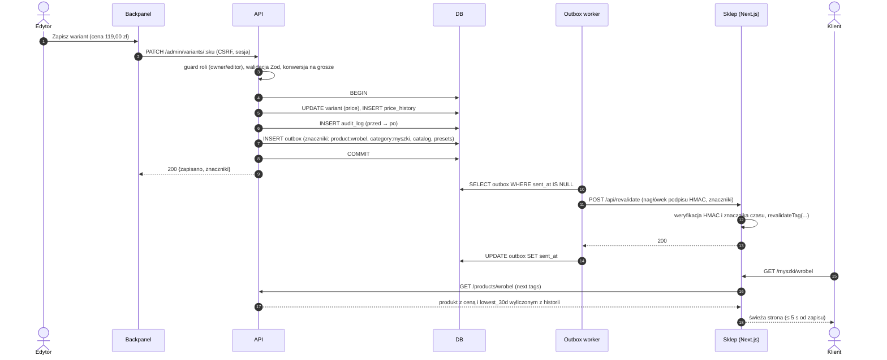
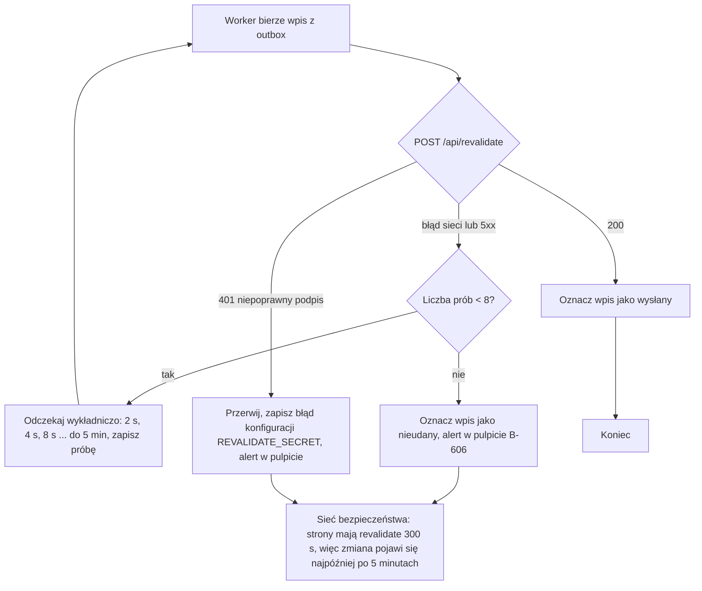
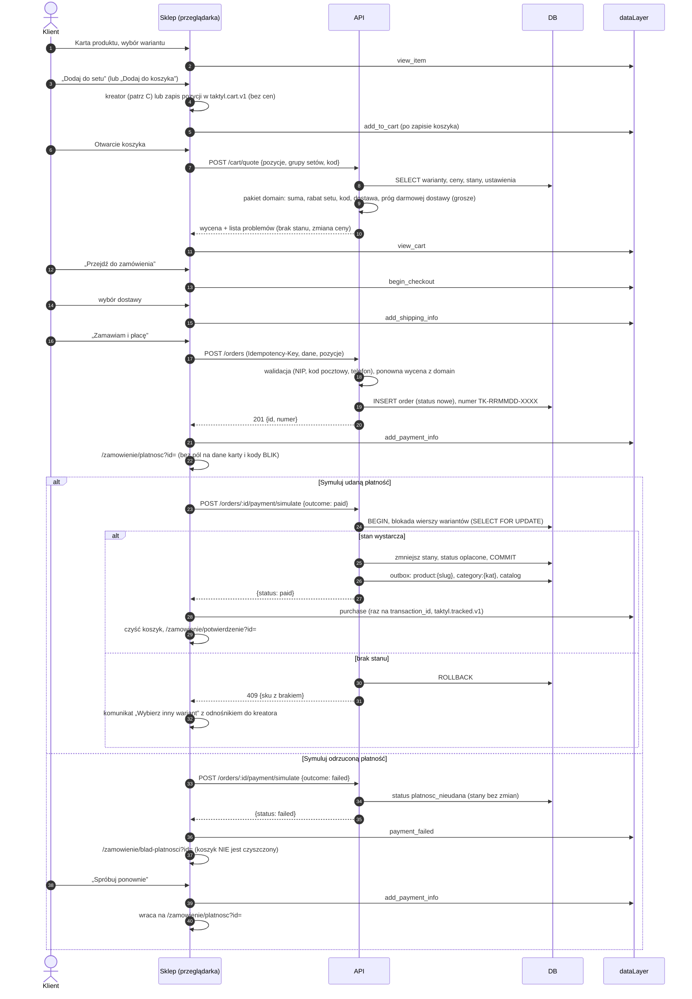
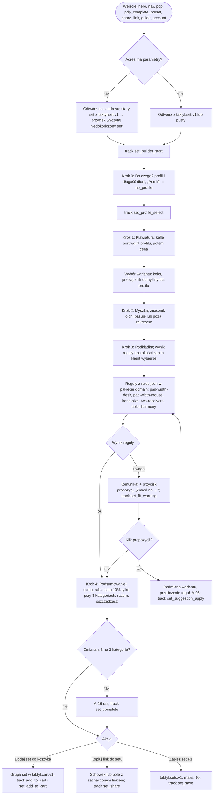
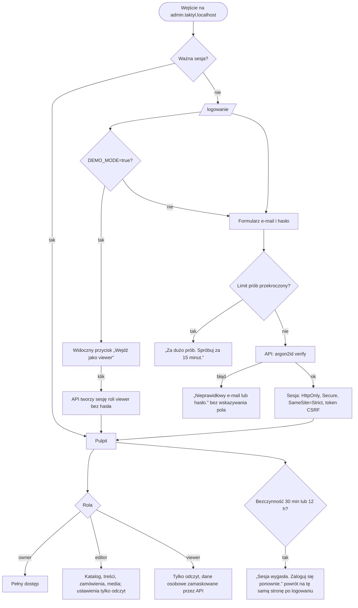
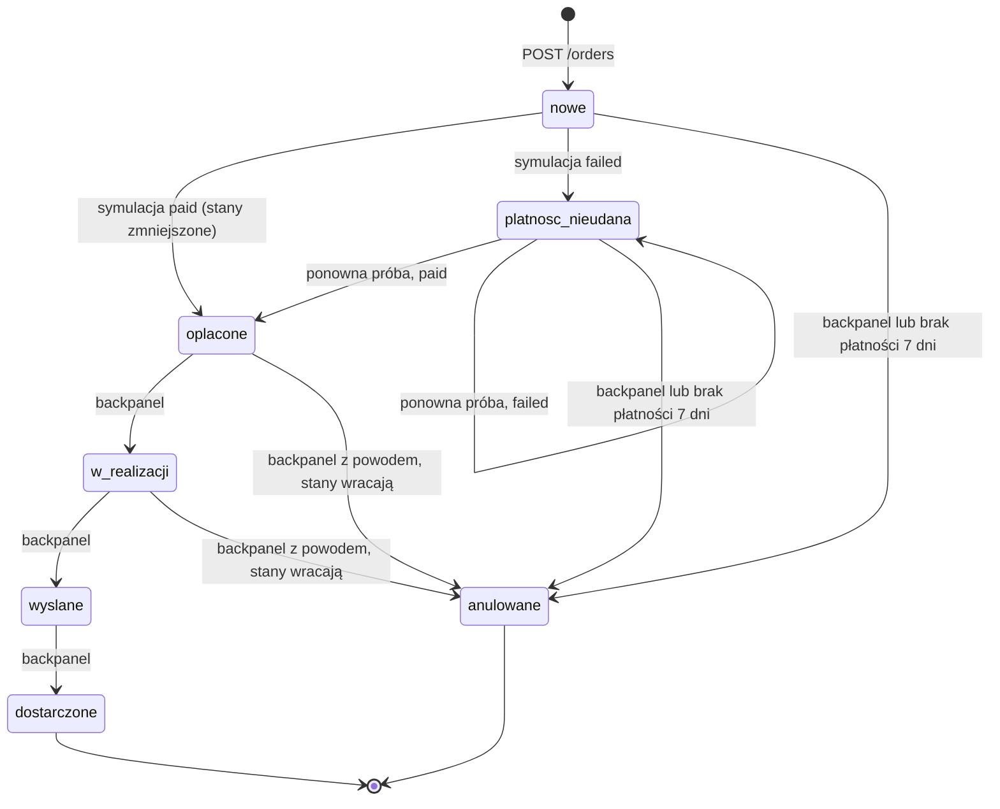
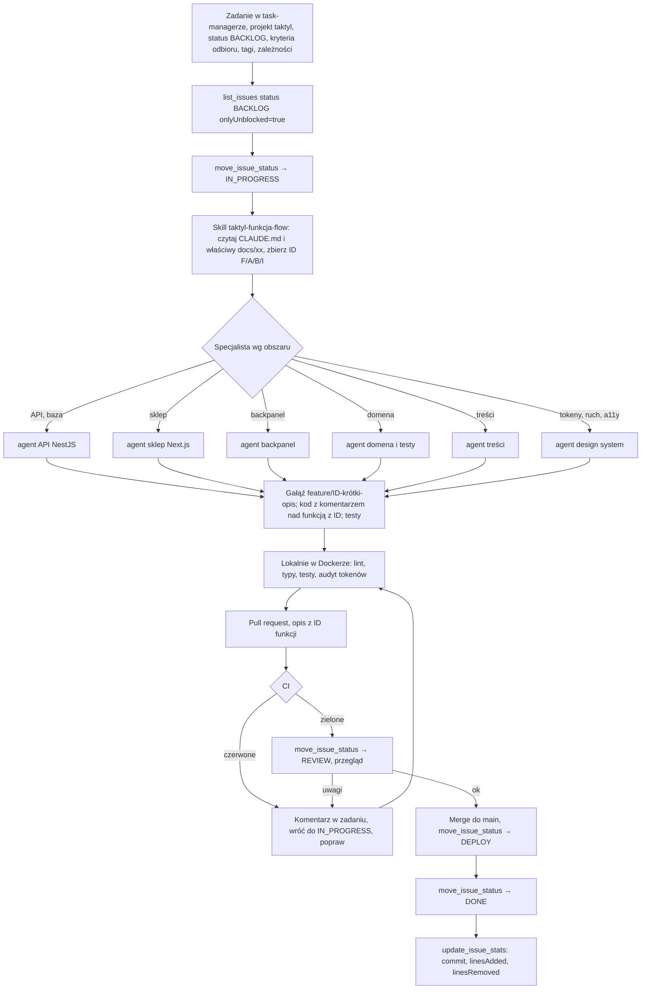
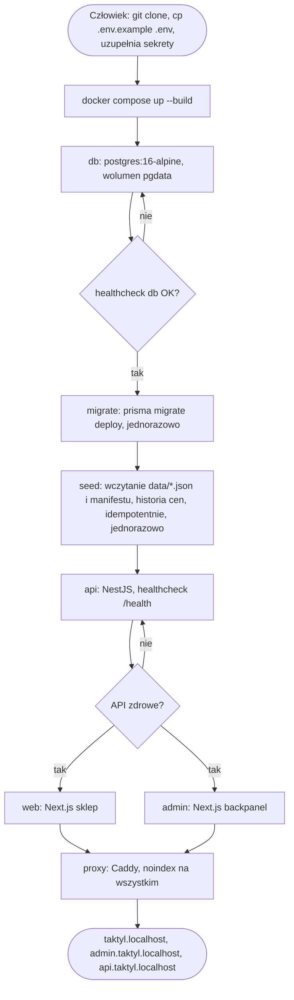
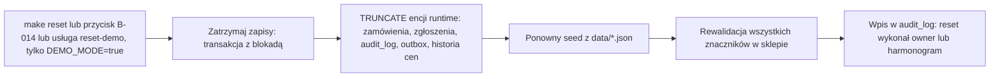
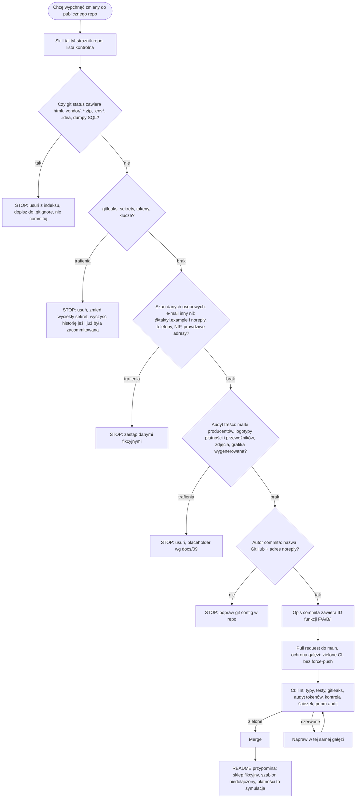

# 18 · Przepływy

Diagramy w składni Mermaid (renderuje je GitHub). Opisują zachowanie systemu zgodnie z ADR-0001…0009, `docs/03` (kreator), `docs/10` (pomiar), `docs/15` (backpanel). Przy rozbieżności obowiązują dokumenty źródłowe, ten plik trzeba poprawić.

Skróty: **API** — NestJS (`apps/api`), **Sklep** — Next.js (`apps/web`), **Backpanel** — Next.js (`apps/admin`), **DB** — PostgreSQL.

---

## A. Zmiana ceny w backpanelu → widoczna w sklepie (ADR-0003, B-104)

**Opis.** Zapis, historia cen, dziennik i wpis do kolejki powstają w **jednej transakcji**; wysyłka do sklepu dopiero po commicie. `lowest_30d` nie jest zapisywane przez nikogo: API liczy je z `price_history` przy odczycie (Omnibus, `docs/04` §5.2). Strony sklepu są cache'owane po znacznikach, więc po `revalidateTag` następne żądanie odbudowuje stronę.

### A.1. Obsługa awarii

**Zasady.** Awaria sklepu **nie cofa** zapisu w API. Ponowienia są idempotentne (`revalidateTag` można wywołać wielokrotnie). Pulpit (B-606) pokazuje liczbę zdarzeń w kolejce i czas ostatniej udanej rewalidacji. Dane zmienne (stan, ceny w koszyku) i tak są weryfikowane przy wycenie, więc stara strona listingu nie sprzeda towaru bez stanu (F-157).

---

## B. Ścieżka zakupu: karta produktu → potwierdzenie (F-060…F-180, ADR-0007, `docs/10`)

**Opis.** Cena nigdy nie jest zapisana w koszyku (`docs/03` §7); każde otwarcie koszyka pyta API o wycenę. Zamówienie liczy API, kwoty z klienta są ignorowane. **Stan zmniejsza się przy udanej płatności**, nie przy utworzeniu zamówienia (ADR-0007). `purchase` wysyła klient dokładnie raz na `transaction_id`; odświeżenie potwierdzenia nie powiela go (S20). `Idempotency-Key` chroni przed podwójnym kliknięciem „Zamawiam i płacę”. Zdarzenia nie zawierają danych osobowych.

---

## C. Kreator setu (`docs/03`, F-100…F-115)

**Zasady.** Kreator doradza i **nigdy nie blokuje**: każdy set da się dodać do koszyka (`docs/03`, zasada nadrzędna). Wynik reguł liczy ten sam pakiet `domain`, który w API wycenia zamówienie, więc podgląd i serwer nie rozjadą się. Brak stanu wariantu nie usuwa go z setu — oznacza „Brak, wybierz inny wariant” i wyłącza dodanie do koszyka z wyjaśnieniem. Przykłady kontrolne (6 setów z `docs/03` §4.4 i 4 sety z `presets.json`) są testami jednostkowymi pakietu `domain`.

---

## D. Logowanie do backpanelu i tryb demo (ADR-0006, B-001…B-009)

**Zasady.** Konto początkowe powstaje z `ADMIN_BOOTSTRAP_EMAIL` i `ADMIN_BOOTSTRAP_PASSWORD` w `.env` (poza repozytorium; w repo tylko `.env.example` z placeholderami `@taktyl.example`). Rola `viewer` istnieje tylko przy `DEMO_MODE=true`, nie ma hasła i nie może zapisać niczego: guard w API odpowiada 403, nawet gdy ktoś pominie UI. Sklep nie ma żadnych pól hasła (F-200).

---

## E. Maszyna stanów zamówienia (B-203, B-205, F-177…F-180)

| Status | Znaczenie | Kto przechodzi dalej |
|---|---|---|
| `nowe` | zamówienie utworzone, czeka na płatność | klient (symulacja), system (po 7 dniach → `anulowane`) |
| `platnosc_nieudana` | symulacja odrzucona, koszyk klienta nietknięty | klient, system |
| `oplacone` | symulacja udana, stany zmniejszone | edytor |
| `w_realizacji` | zamówienie pakowane | edytor |
| `wyslane` | oznaczone jako wysłane (w demo nic nie jest wysyłane) | edytor |
| `dostarczone` | koniec | — |
| `anulowane` | z powodem; z `oplacone` i `w_realizacji` zwraca stany | — |

**Reguły.** Przejście spoza tabeli → 409 w API. Każda zmiana statusu zapisuje wiersz historii (kto, kiedy) i wpis w `audit_log`. Zmniejszenie stanu następuje tylko na przejściu `→ oplacone`, zwrot tylko na `oplacone|w_realizacji → anulowane`. Wysyłki i dostawy są symulowane: system nigdy nie kontaktuje się z przewoźnikiem ani nie wysyła e-maili.

---

## F. Przepływ pracy agentów: od zadania do `DONE`

**CI sprawdza** (wszystko w kontenerach, ADR-0009): lint, typy, testy jednostkowe (`domain`, API), gitleaks (sekrety), audyt tokenów (zero trafień `#[0-9a-fA-F]{3,8}` i `rgb(` poza plikiem tokenów, poza `colors.json → swatch`), kontrolę ścieżek (`html/`, `vendor/`, `*.zip`, `.env*` nie są śledzone), budowę obrazów, a na gałęzi `main` także e2e (S1–S25) i budżet wydajności. Commit zawiera ID funkcji w opisie (reguła 8 `CLAUDE.md`). Gdy przegląd lub CI zawiedzie: `add_comment` z powodem, powrót do `IN_PROGRESS`. Zadanie bez kryteriów odbioru nie wchodzi do `IN_PROGRESS` (Definition of Ready).

---

## G. Uruchomienie Docker Compose od zera i reset demo (ADR-0009, ADR-0005)

**Zasady.** Sekrety tylko w `.env`, nie w obrazach. Obrazy działają jako użytkownik nie-root, Next.js w trybie `standalone`. Testy (`docker compose --profile test run --rm test`) zaczynają od `db:reset-demo`, bo wartości oczekiwane z `docs/12` wynikają z seedu. Reset nie rusza użytkowników backpanelu ani plików wgranych do wolumenu `media` (poza opcją „z mediami” dla `owner`).

---

## H. Publikacja repozytorium (ADR-0008, skill `taktyl-straznik-repo`)

**Zasady.** Historia git jest publiczna na zawsze, więc kontrole działają **przed** commitem; sekret, który raz trafił do commita, uznaje się za wyciekły (zmiana sekretu jest obowiązkowa, samo usunięcie pliku nie wystarcza). Licencja szablonu Crafto nie pozwala na publikację jego plików: w repo są wyłącznie nasze komponenty na Bootstrapie i tokenach, a katalog `vendor/crafto/` jest lokalny i w `.gitignore` (ADR-0004; pytanie Q-01 w `docs/decyzje.md` czeka na potwierdzenie).
